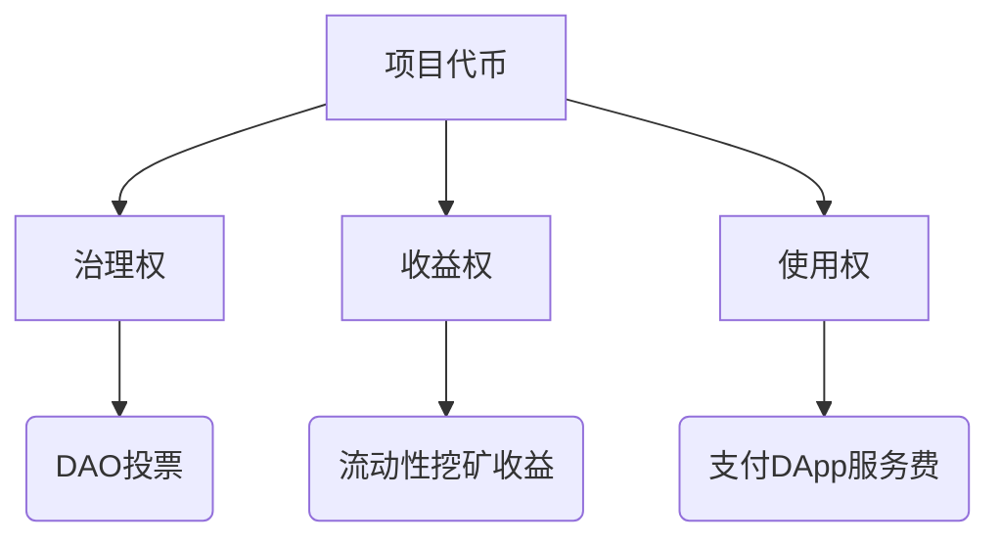

> 请在上边的 timezone 添加你的当地时区(UTC)，这会有助于你的打卡状态的自动化更新，如果没有添加，默认为北京时间 UTC+8 时区

# Azhan

1. 自我介绍

   ​	Hello！大家好，我是一名区块链在读的学生，之前是在网络安全领域学习深造，荣获了一些奖项，接触到web3，深深痴迷于web3技术，想要从rookie进化为master，同时也是我所在高校的链协会长（其实本身没什么web3技术，更多是想要寻找志同道合的人），一起加油吧

2. 你认为你会完成本次残酷学习吗？

   ​	有信心完成本次的残酷学习

3. 你的联系方式（推荐 Telegram）

   https://t.me/Azhan1431

## Notes

<!-- Content_START -->

### 2025.03.03

####  Web3是什么

Web3 代表了互联网的下一代形态，它更开放、公平、安全，赋予用户真正的数据所有权。回顾互联网的发展历程：

- **Web1.0**（静态网页）：用户只能被动浏览固定内容，缺乏互动性。只读
- **Web2.0**（社交网络）：用户可以创建内容，互动交流，但数据掌握在中心化平台手中，如社交媒体、电子商务等。读写
- **Web3.0**（去中心化互联网）：通过区块链、智能合约等技术，实现数据自主权，每个用户都可以掌控自己的数据和数字资产。

在 Web3 时代，互联网由去中心化的网络支撑，不再依赖于少数科技巨头，而是基于区块链和加密技术，确保信息的安全、透明和不可篡改。，自己将会是自己的主人

Great love leads the revolution!

### 2025.03.04

#### 数字资产是什么

简单来说，数字资产是一种存在于数字形式的资产。听起来很简单，对吧？但这还不是全部。数字资产可以是你的电子邮件、照片、音乐、电子书，甚至是那些神秘的加密货币

#### 风险

数字资产同样会有风险，价格波动，黑客攻击导致一些技术问题，法规变化等

#### 开始

1. **研究**：首先，花一些时间了解不同的数字资产及其工作原理。
2. **选择一个钱包**：你需要一个地方存储你的数字资产，包括硬件钱包、软件钱包和在线钱包。
3. **购买数字资产**：选择一个信誉良好的交易所进行购买，并注意安全存储。
4. **学习安全措施**：了解如何保护你的资产，避免成为黑客的目标。

### 2025.03.05

#### 加密货币

Meme币：

- **文化驱动**：依赖互联网流行文化/病毒式传播  
- **低实用性**：无实际应用场景，以娱乐性吸引用户  
- **高投机性**：价格剧烈波动，受市场情绪主导  

公链原生代币：

- **网络燃料**：支付交易手续费/Gas费  
- **安全维护**：通过质押机制保障网络安全（如PoS机制）  
- **价值载体**：反映底层公链生态价值  

项目代币：

创新点

- **复合型金融工具**：单一代币可兼具股权/债权/期权属性  
- **可编程性**：通过智能合约实现自动分红、回购等机制  

稳定币：

| 类别       | 锚定方式     | 典型案例      | 波动率 | 监管难度     |
| ---------- | ------------ | ------------- | ------ | ------------ |
| 法币抵押型 | 1:1美元储备  | USDT,USDC     | <0.5%  | 需定期审计   |
| 加密抵押型 | 超额链上抵押 | DAI           | <3%    | 去中心化管理 |
| 算法稳定币 | 供需算法调控 | UST（已崩溃） | >20%   | 无实体监管   |

应用场景

- 交易所避险工具（占加密货币交易量60%+）
- DeFi协议基础流动性池
- 跨境支付结算（处理速度<5分钟）

### 2025.07.11

笔记内容

### 2025.07.12

<!-- Content_END -->
