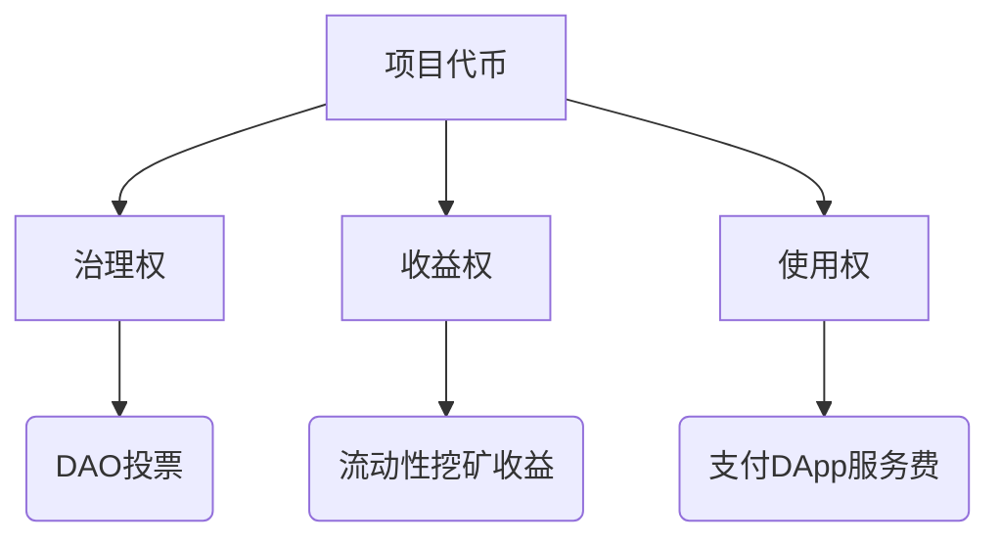

> 请在上边的 timezone 添加你的当地时区(UTC)，这会有助于你的打卡状态的自动化更新，如果没有添加，默认为北京时间 UTC+8 时区

# Azhan

1. 自我介绍

   ​	Hello！大家好，我是一名区块链在读的学生，之前是在网络安全领域学习深造，荣获了一些奖项，接触到web3，深深痴迷于web3技术，想要从rookie进化为master，同时也是我所在高校的链协会长（其实本身没什么web3技术，更多是想要寻找志同道合的人），一起加油吧

2. 你认为你会完成本次残酷学习吗？

   ​	有信心完成本次的残酷学习

3. 你的联系方式（推荐 Telegram）

   https://t.me/Azhan1431

## Notes

<!-- Content_START -->

### 2025.03.03

####  Web3是什么

Web3 代表了互联网的下一代形态，它更开放、公平、安全，赋予用户真正的数据所有权。回顾互联网的发展历程：

- **Web1.0**（静态网页）：用户只能被动浏览固定内容，缺乏互动性。只读
- **Web2.0**（社交网络）：用户可以创建内容，互动交流，但数据掌握在中心化平台手中，如社交媒体、电子商务等。读写
- **Web3.0**（去中心化互联网）：通过区块链、智能合约等技术，实现数据自主权，每个用户都可以掌控自己的数据和数字资产。

在 Web3 时代，互联网由去中心化的网络支撑，不再依赖于少数科技巨头，而是基于区块链和加密技术，确保信息的安全、透明和不可篡改。，自己将会是自己的主人

Great love leads the revolution!

### 2025.03.04

#### 数字资产是什么

简单来说，数字资产是一种存在于数字形式的资产。听起来很简单，对吧？但这还不是全部。数字资产可以是你的电子邮件、照片、音乐、电子书，甚至是那些神秘的加密货币

#### 风险

数字资产同样会有风险，价格波动，黑客攻击导致一些技术问题，法规变化等

#### 开始

1. **研究**：首先，花一些时间了解不同的数字资产及其工作原理。
2. **选择一个钱包**：你需要一个地方存储你的数字资产，包括硬件钱包、软件钱包和在线钱包。
3. **购买数字资产**：选择一个信誉良好的交易所进行购买，并注意安全存储。
4. **学习安全措施**：了解如何保护你的资产，避免成为黑客的目标。

### 2025.03.05

#### 加密货币

Meme币：

- **文化驱动**：依赖互联网流行文化/病毒式传播  
- **低实用性**：无实际应用场景，以娱乐性吸引用户  
- **高投机性**：价格剧烈波动，受市场情绪主导  

公链原生代币：

- **网络燃料**：支付交易手续费/Gas费  
- **安全维护**：通过质押机制保障网络安全（如PoS机制）  
- **价值载体**：反映底层公链生态价值  

项目代币：

创新点

- **复合型金融工具**：单一代币可兼具股权/债权/期权属性  
- **可编程性**：通过智能合约实现自动分红、回购等机制  

稳定币：

| 类别       | 锚定方式     | 典型案例      | 波动率 | 监管难度     |
| ---------- | ------------ | ------------- | ------ | ------------ |
| 法币抵押型 | 1:1美元储备  | USDT,USDC     | <0.5%  | 需定期审计   |
| 加密抵押型 | 超额链上抵押 | DAI           | <3%    | 去中心化管理 |
| 算法稳定币 | 供需算法调控 | UST（已崩溃） | >20%   | 无实体监管   |

应用场景

- 交易所避险工具（占加密货币交易量60%+）
- DeFi协议基础流动性池
- 跨境支付结算（处理速度<5分钟）

### 2025.03.06

私钥与助记词：

1. **私钥的定义与作用**
   - 私钥是一个256位的随机数，控制加密资产的所有权。
   - 用于计算地址、交易签名和资产恢复。
2. **私钥的安全性**
   - 私钥的可能性空间极大（$2^{256}$），暴力破解几乎不可能。
   - 需要使用高质量的随机数生成算法确保安全。
3. **助记词的作用**
   - 助记词是私钥的另一种表现形式，通常为12-24个单词。
   - 便于备份，可派生多个私钥，支持多币种。
4. **助记词的通用性与标准**
   - 基于BIP32、BIP39、BIP44协议，助记词可跨钱包使用（但不同钱包安全性不同，不建议混用）。
5. **备份与恢复须知**
   - 私钥和助记词需离线备份，防止被盗。
   - 确保抄写正确，特别是助记词，避免错字或顺序错误。
   - 不建议在多个钱包之间混用助记词。
6. **常见问题及解决方案**
   - 若助记词无效，可对照官方词库检查是否有错误。
   - 助记词的中文版本可能存在生僻字问题，建议优先使用英文版。
7. **未来发展趋势**
   - 助记词已成为行业标准，即使未来有新备份方式，仍可长期使用。

### 2025.03.07

区块链钱包：

区块链钱包是管理和存储加密货币的核心工具，类似于传统银行账户，但它赋予用户完全的资金掌控权。通过钱包，你可以安全地存储、发送和接收加密货币，而无需依赖银行或第三方机构。

#### **类型**

1. **软件钱包（热钱包）**：基于Web、移动端或桌面端，使用方便，但易受黑客攻击。
2. **硬件钱包（冷钱包）**：物理设备，私钥离线存储，安全性高但操作相对复杂。
3. **纸钱包**：将私钥和公钥打印在纸上，适用于长期离线存储。

#### **账户模型**

- **传统账户模型**（如以太坊）：类似银行账户，余额随交易更新。
- **UTXO模型**（如比特币）：基于交易输入/输出，每笔交易需引用前一笔的未花费余额。

#### **以太坊账户**

- **外部所有账户（EOA）**：由用户控制，可发送交易。
- **合约账户（CA）**：运行智能合约，无法自主发起交易。

#### **私钥 vs 公钥**

- **私钥**：控制资金的核心密钥，必须严格保管。
- **公钥**：生成钱包地址，供他人发送加密货币。

#### **选择合适的钱包**

- **安全性**：选择安全性高、有良好口碑的钱包。
- **兼容性**：确保支持所需的加密货币。
- **备份与防护**：定期备份，避免私钥泄露，防范钓鱼攻击。

### 2025.03.08

web3术语：

#### A

- **ABI（Application Binary Interface）**：应用二进制接口，机器代码层面两个二进制程序模块的接口，而非源代码。
- **地址**：区块链钱包地址。
- **AMA（Ask Me Anything）**：项目方或交易负责人举办的问答活动。
- **AMM（Automated Market Maker）**：自动做市商。
- **Alpha**：早期的、内部的投资建议或情报，通常与加密货币和 NFT 相关。
- **空投（Airdrop）**：加密货币项目直接将代币发送到用户钱包的营销方式。
- **Avatar**：虚拟化身，如 VR、视频游戏或其他虚拟空间中的数字形象。
- **Avatar 项目**：指包含数千枚 NFT 头像的收藏品，如 CryptoPunks、Bored Ape Yacht Club。
- **ATH（All-Time High）**：历史最高点。
- **山寨币（Altcoin）**：最初指非比特币的加密货币，现在可指市值相对较小的新加密货币。
- **Alts**：altcoins 的缩写。
- **归档节点（Archive Node）**：区块链中的完整节点，保留完整交易历史和地址状态变化。
- **Arbitrum**：以太坊二层扩展解决方案，减少主网交易费用和网络堵塞。
- **Apeing In**：不经过调查盲目购买 NFT 项目。

B

- **BTC（Bitcoin）**：比特币，第一个也是最流行的去中心化数字货币。
- **币圈**：参与加密货币项目或持有加密货币的人的圈子。
- **Beta 收益（β）**：市场或资产的平均收益率。
- **燃烧（Burn）**：销毁 NFT 或代币，以减少流通量。
- **熊市（Bear Market）**：市场长期下跌期。
- **看跌（Bearish）**：对市场持悲观态度，认为价格会下跌。
- **区块（Block）**：区块链中的交易记录单位。
- **区块链（Blockchain）**：去中心化的数字账本。
- **桥接（Bridge）**：不同区块链间转移资产或数据的协议。
- **牛市（Bull Market）**：市场长期上涨期。
- **看涨（Bullish）**：对市场持乐观态度，认为价格会上涨。
- **BTD（Buy The Dip）**：逢低买入。
- **Bagholder**：持有已严重贬值资产的投资者。

#### C

- **CEX（Centralized Exchange）**：中心化交易所，如 Binance、Coinbase。
- **冷钱包（Cold Wallet）**：离线存储加密资产的设备，较安全。
- **CeFi（Centralized Finance）**：中心化金融，如 BlockFi、Grayscale。
- **硬币（Coin）**：建立在自己区块链上的加密货币，如 BTC、ETH。
- **抵押品（Collateral）**：可用于贷款担保的资产。
- **共识机制（Consensus Mechanism）**：区块链达成共识的方法，如 PoW、PoS。
- **加密货币（Cryptocurrency）**：基于区块链的数字资产。
- **创世（Genesis）**：加密资产的第一波发售。
- **持仓（Holding）**：持有某种加密资产的行为。

#### D

- **DeFi（Decentralized Finance）**：去中心化金融，不依赖银行的金融系统。
- **DD（Due Diligence）**：尽职调查，投资前的研究过程。
- **DYOR（Do Your Own Research）**：自己做研究。
- **DAO（Decentralized Autonomous Organization）**：去中心化自治组织。
- **DApp（Decentralized Application）**：去中心化应用。
- **德根（Degenerate）**：原指“堕落赌徒”，后指高风险投资者。
- **DEX（Decentralized Exchange）**：去中心化交易所，如 Uniswap、SushiSwap。
- **Diamond Hands**：长期持有，不因市场波动而出售资产。
- **Discord**：Web3 社区常用的社交软件。
- **难度炸弹（Difficulty Bomb）**：工作量证明区块链的难度增加机制。
- **分布式账本（Distributed Ledger）**：去中心化存储和管理数据的系统。

#### **E**

- **EIP (Ethereum Improvement Proposal)**：以太坊改进提案，用于提议和规范以太坊的技术改进。
- **ERC (Ethereum Request for Comment)**：以太坊代币标准，例如ERC-20（同质化代币标准）、ERC-721（非同质化代币标准）、ERC-1155（多代币标准）。
- **ETH (Ether)**：以太坊的原生加密货币，用于支付交易费用和智能合约执行成本。
- **Ethereum 2.0 (Eth2, Serenity)**：以太坊的升级版本，引入权益证明（PoS）和分片技术，以提高可扩展性和效率。
- **Ethereum Virtual Machine (EVM)**：以太坊虚拟机，运行智能合约的去中心化计算环境。
- **Exchange**：加密货币交易所，分为中心化交易所（CEX）和去中心化交易所（DEX）。

#### **F**

- **Fiat**：法定货币，如美元、欧元、人民币。
- **FOMO (Fear of Missing Out)**：害怕错过，指投资者因害怕错过机会而盲目投资。
- **Fork**：分叉，指区块链协议的分裂，分为软分叉（Soft Fork）和硬分叉（Hard Fork）。
- **Front-running**：抢跑交易，指某些交易者在他人交易之前提前进行交易以获利。
- **Fungibility**：可替代性，指代币或资产在经济系统中的可互换性。

#### **G**

- **Gas Fee**：交易手续费，用户在以太坊等区块链上执行交易或智能合约时需支付的费用。
- **Genesis Block**：创世区块，区块链的第一个区块。
- **Governance Token**：治理代币，赋予持有者参与协议治理的权利。
- **Gwei**：以太坊Gas费的最小单位，1 Gwei = 0.000000001 ETH。

#### **H**

- **Halving**：减半，比特币和其他PoW区块链定期减少区块奖励的机制。
- **Hash**：哈希值，通过加密算法生成的数据指纹。
- **Hash Rate**：哈希率，衡量挖矿计算能力的指标。
- **HODL**：持有不卖，源于“Hold”的误拼，指长期持有加密资产的投资策略。
- **Hot Wallet**：热钱包，联网的钱包，适用于日常交易但安全性较低。

#### **I**

- **ICO (Initial Coin Offering)**：首次代币发行，类似于IPO（首次公开募股），用于区块链项目融资。
- **IDO (Initial DEX Offering)**：去中心化交易所上的首次代币发行。
- **IEO (Initial Exchange Offering)**：交易所发起的代币发行，通常由中心化交易所管理。
- **Impermanent Loss**：无常损失，指在流动性池中提供流动性时，因价格变化而导致的潜在损失。
- **Interoperability**：互操作性，不同区块链之间通信和交互的能力。

### 2025.03.09

[文章](https://wallstreetcn.com/articles/3649370)

这篇文章采访了以太坊联合创始人Gavin Wood，他深入探讨了Web3的概念及其对未来互联网的影响。Gavin认为，当前的Web2.0模式过于中心化，权力集中在少数科技巨头手中，存在信任和监管失效等问题。他提出，Web3旨在通过区块链技术实现去中心化，减少对中介机构的依赖，赋予用户更多的控制权和自由。

在Gavin的构想中，Web3不仅是技术的革新，更是一场社会运动，推动从任意权力向理性自由的转变。他强调，Web3的核心在于“少一点信任，多一点真实”，通过开放和透明的机制，确保用户的期望能够得到满足。

总体而言，Gavin对Web3的展望充满理想主义，他希望通过技术创新，构建一个更加公平、自由的互联网生态系统

术语：

#### K

- **Kovan**：一个权威认证，可以公开访问的以太坊测试网。
- **KYC**：实名认证。
- **科学家**：写出厉害代码机器人来完成自己目的的工程师，或者购买对应机器的人，在代币/NFT公售时以最快的速度扫货。

#### L

- **L1（Layer1）**：扩容方案，又称链上扩容，指在区块链底层协议上实现的扩容解决方案。
- **L2（Layer2）**：扩容方案，又称链下扩容，指不改变区块链底层协议和基础规则，通过状态通道、侧链等方案提高交易处理速度。
- **L3（Layer3）**：客户端应用层，用户交互的UI平台。
- **Lambo**：兰博基尼的简称，加密货币圈常用。例如“Wen Lambo？”意思是“什么时候我能靠这项投资买兰博基尼？”
- **轻节点**：从区块链下载的数据只够处理和验证交易的区块链节点。
- **Liquidity Pool（流动性池）**：用户提供的资金合集，锁定在智能合约中，以促进 DeFi 平台上的交易。

#### M

- **主节点**：存储区块链完整历史、验证和转发交易的节点，可参与投票和治理。
- **元宇宙**：数字化的持久网络空间。
- **Mempool（矿池）**：存储待处理交易的内存数据结构。
- **铸造**：验证信息的过程，执行该过程的参与者被称为矿工。
- **Moonboy（月亮男孩）**：对某项资产极度乐观的人。
- **Merkle Root（默克尔树根）**：用于验证区块内所有交易的哈希值。
- **Merkle Tree（默克尔树）**：一种数据结构，保障区块链数据安全。
- **MEV（矿工可提取价值）**：矿工通过交易排序、插入、删除等方式获取的额外利润。

#### N

- **NFT（非同质化代币）**：用于分配和验证独特的数字或实物资产的真实性。
- **NGMI（不会成功）**：用于暗示某个项目不会变得有价值。
- **Nocoiner**：不持有任何加密货币的人。
- **节点**：连接到区块链网络的任何设备。

#### O

- **Oracle（预言机）**：为智能合约提供链外数据的服务。
- **Off-chain（链外）**：不存储在区块链上的数据或交易。
- **On-chain（链上）**：存储在区块链上的数据或交易。
- **OTC（场外交易）**：直接在买卖双方之间进行的交易。

#### P

- **P2P（点对点）**：没有中央服务器的去中心化网络。
- **Paper Hands（纸手）**：市场下跌时因恐慌而抛售资产的人。
- **PFP（个人资料图片）**：通常指NFT头像。
- **私钥**：访问和控制区块链资产的加密密钥。
- **PoS（权益证明）**：通过质押代币来参与验证交易。
- **PoW（工作量证明）**：通过计算复杂数学问题来验证交易并获取奖励。
- **公钥**：类似银行账户地址的区块链钱包地址。
- **Pump and Dump（抽水和倾倒）**：通过夸大宣传提高价格后快速抛售的骗局。

#### Q

- **Queued Pool（队列池）**：Mempool中因“失序”而尚未准备好被处理的交易池。

#### R

- **Rugged**：被Web3项目欺骗或诈骗。
- **Rekt**：因投资失败而遭受重大损失。
- **Rug（Rug Pull）**：项目方跑路的诈骗行为。
- **路线图**：NFT项目计划未来发展的路线。

#### S

- **质押**：将代币锁定在智能合约中以获取奖励。
- **Satoshis/Sats**：BTC的最小单位（0.00000001 BTC）。
- **Ser**：“先生”的误写，加密圈俚语。
- **SHA-256**：由NSA设计的安全散列算法。
- **Sidechain（侧链）**：提高扩展性或增加功能的平行区块链。
- **削减（Slashing）**：对作恶验证者的加密货币惩罚。
- **滑点（Slippage）**：交易执行价格与预期价格之间的差异。
- **智能合约**：自动执行合约条款的区块链代码。
- **稳定币**：与法币或其他资产挂钩的代币。

#### T

- **测试网**：用于测试网络升级和智能合约的区块链环境。
- **Token（代币）**：在区块链上创建的数字资产。
- **TPS（每秒交易数）**：衡量区块链处理能力的指标。
- **TVL（锁定总价值）**：Dapp智能合约中锁定的资产价值。
- **Txn Hash（交易哈希值）**：交易的唯一标识符。

#### U

- **只涨（Up Only）**：加密圈玩笑语，表达对某资产的乐观态度。

#### V

- **Vaporware（蒸发产品）**：宣布但未真正实现的产品或项目。

#### W

- **WAGMI（We Are Gonna Make It）**：表示乐观和成功信念的加密俚语。
- **Whale（巨鲸）**：持有大量加密资产的个人或机构。
- **Web3.0**：强调去中心化、数据自主权和隐私保护的下一代互联网。

#### X

- **XR（扩展现实）**：包括AR、VR、MR等技术的统称。
- **X2E（X to Earn）**：任何可在Web3中获利的行为。

#### Y

- **YOLO（You Only Live Once）**：在Web3中指高风险投资行为。
- **Your Bags**：你的加密资产。

#### Z

- **ZK（零知识证明）**：一种可验证信息真实性但不披露内容的加密技术。

#### 其他

- **51%Attack（51%攻击）**：当某个实体控制区块链超过51%算力时，可进行双花攻击等恶意行为。
- **1:1 Art**：每件作品都是独一无二的NFT。
- **10k project**：通常指包含约1万个头像的NFT系列。

### 2025.03.10

#### 区块链：

区块链（Blockchain）是一种去中心化的分布式账本技术，它通过区块（Block）和链（Chain）结构存储数据，并采用密码学技术确保数据的安全性和不可篡改性。

**特点：**

- **去中心化**：数据存储在多个节点上，避免单点故障。
- **不可篡改**：一旦数据写入区块链，就无法更改。
- **透明性**：所有交易对所有参与者可见，增强信任。

##### 工作原理：

###### **2.1 区块与链**

- **区块（Block）**：包含交易记录，每个区块由区块头（Header）和区块主体（Body）组成。
- **链（Chain）**：各个区块通过哈希值连接，形成链式结构。

###### **2.2 P2P网络（去中心化网络）**

- 采用点对点（P2P）通信，每个节点（Node）都可以存储完整账本。
- 交易通过广播方式同步到全网。

###### **2.3 哈希函数与不可篡改性**

- ###### 每个区块包含前一个区块的哈希值（Previous Hash）。

- 任何修改都会导致整个链条的哈希值发生变化，使篡改变得极难。

###### **2.4 共识机制（Consensus Mechanism）**

区块链系统采用共识机制来保证数据一致性。常见的共识算法有：

- **工作量证明（PoW）**：矿工通过计算哈希值竞争记账权（如比特币）。
- **权益证明（PoS）**：基于持币数量和时间分配记账权（如以太坊2.0）。
- **拜占庭容错（BFT）**：提高系统在恶意节点存在时的可靠性。

###### **2.5 智能合约（Smart Contract）**

- 智能合约是运行在区块链上的自动执行程序。
- 以太坊使用Solidity编写智能合约，支持去中心化应用（DApp）。

##### **区块链的应用领域**

###### **3.1 加密货币**

- 比特币（Bitcoin）：首个基于区块链的数字货币。
- 以太坊（Ethereum）：支持智能合约和去中心化应用。

###### **3.2 供应链管理**

- 透明化物流跟踪，提高供应链效率。

###### **3.3 金融服务（DeFi）**

- 去中心化金融（DeFi）提供无需中介的金融服务。

###### **3.4 医疗健康**

- 安全存储和共享患者数据，提高医疗效率。

###### **3.5 数字身份（DID）**

- 去中心化身份管理，增强隐私保护。

###### **3.6 NFT（非同质化代币）**

- 用于数字艺术品、游戏资产等数字资产的所有权证明。

### 2025.03.11

Layer1：

Layer1 是区块链的第一层，负责交易处理、验证和记录。它就像一座城市的地基，决定了整个生态系统的稳定性和扩展性。

#### **Layer1 的起源**

最早的 Layer1 诞生于比特币的出现，当时人们探索如何在去中心化环境中安全地记录交易。这种探索催生了 Layer1 技术的发展，为去中心化网络奠定了基础。

#### **Layer1 的核心技术**

- 共识机制
  - 工作量证明（PoW）：通过解决复杂数学问题来验证交易（如比特币）。
  - 权益证明（PoS）：通过持币量和持币时间选出验证者，更加节能（如以太坊 2.0）。
- **网络结构**：决定数据传播方式，影响区块链的效率、安全性和去中心化程度。

#### **公链：开放的数字大道**

公链是 Layer1 技术的核心应用，代表着去中心化和透明性。

- 公链代表
  - **比特币（Bitcoin）**：最早的区块链，开创数字货币时代。
  - **以太坊（Ethereum）**：引入智能合约，拓展区块链应用场景。
  - **莱特币（Litecoin）、卡尔达诺（Cardano）** 等：提供不同的技术创新。
- 公链的挑战
  - **可扩展性**：交易处理能力有限，导致网络拥堵。
  - **能源消耗**：特别是 PoW 机制下，高能耗问题突出。

#### **联盟链：协作的桥梁**

联盟链介于公链与私链之间，适用于企业和组织之间的合作。

- 联盟链代表
  - **R3 Corda**：提高金融交易效率。
  - **Hyperledger Fabric**：企业级区块链解决方案。
  - **Quorum**：摩根大通开发的企业区块链。
- 联盟链的优势
  - 高效率、低成本。
  - 更好的隐私保护，适用于敏感数据管理。

#### **私链：专有的数字领地**

私链是一种封闭的区块链，仅限特定组织或个人使用

- 私链特点
  - **受限访问**：仅授权用户可参与。
  - **高效率**：交易处理速度快，适合内部管理。
  - **定制化控制**：可以根据需求灵活调整规则。
- 私链应用场景
  - **企业数据管理**：存储和管理敏感数据。
  - **内部记录保持**：记录企业内部交易。
  - **供应链跟踪**：确保数据安全可控。
- 私链的挑战
  - **去中心化程度较低**，依赖单一实体管理。
  - **安全性问题**，需要加强内部安全防护。

### 2025.07.11

笔记内容

### 2025.07.12

<!-- Content_END -->
