# Zaki

1. 自我介绍
  自己為一位小碼農，希望能跟大家一起進步
2. 你认为你会完成本次残酷学习吗？
  yes~

## Notes

<!-- Content_START -->

### 2025.03.05

從網際網路誕生至今，已經歷三次重要的變革，每次都深刻影響了我們的生活方式和社會結構。

### 1. Web 1.0時代（only讀網路）

這是網路的早期階段，網站只提供靜態資訊，使用者只能瀏覽和閱讀，無法參與互動。  
內容多為文字與圖片，網站由少數管理者控制，使用者純粹是「資訊接收者」。  
這就像一本電子版百科全書，網際網路是單純的知識來源。

---

### 2. Web 2.0時代（讀寫網路）

Web 2.0讓使用者能夠產生內容，開啟了雙向互動的新時代。  
部落格、社交媒體、影音平台興起，每個人都可以發布內容、留言互動、分享轉發。  
網路從單向資訊流，變成一個全球社群。但這些平台多數是中心化的，資料和流量掌握在少數科技巨頭手中，使用者的資料隱私和數據主權也因此受到威脅。

---

### 3. Web 3.0時代（去中心化網路）

Web 3.0以區塊鏈為基礎，強調去中心化與資料自主權。  
使用者真正擁有自己的數據，不再依賴單一平台。  
這個時代，網路上的價值傳遞不再需要中介，點對點的協作和創新將成為主流。  
Web 3.0被視為回歸網際網路的初衷：開放、自由、民主化。

---

### Web 2.0與Web 3.0的主要差異

| 項目 | Web 2.0 | Web 3.0 |
|---|---|---|
| **控制權** | 中心化，平台掌握一切 | 去中心化，使用者掌握資料 |
| **數據所有權** | 平台所有 | 使用者所有 |
| **互動模式** | 內容互動 | 透過智能合約直接互動 |
| **安全性** | 容易成為攻擊目標 | 分散式架構更安全透明 |
| **商業模式** | 廣告為主，賣數據 | 加密貨幣、代幣經濟、直接支付 |

---

### Web 3.0的額外補充與想像空間

1. **個人數位身份**  
   每個人在Web3.0中擁有獨一無二的去中心化身份（DID），登入、交易、簽署、社交，都不再需要依賴Google或Facebook。

2. **去中心化金融（DeFi）**  
   不再依賴銀行和金融機構，每個人都可以直接借貸、投資、交易。

3. **數位資產與NFT**  
   創作者的每件作品，都能在區塊鏈上紀錄來源與版權，價值可由市場透明定價。

4. **自治組織（DAO）**  
   每個人都可以參與或創建去中心化自治組織，透過代幣治理，社群一起決策發展方向。

5. **元宇宙融合**  
   Web3.0還可能與元宇宙深度結合，虛擬世界中的每筆資產、每次互動、甚至每場活動都將上鏈，形成真正屬於用戶的數位空間。


### 2025.03.06

#### 助記詞與私鑰的關係
助記詞和私鑰的本質都是「隨機數」，它們在功能上是一致的，都是用來掌控你的加密貨幣資產。

助記詞本質上也是一段 128～256 位的隨機數。由於直接使用隨機數或私鑰都太不方便，為了改善使用體驗，比特幣社群制定了 **BIP39** 協議，將隨機數透過特定的編碼方式，轉換為一組由詞庫中單詞組成的助記詞。

助記詞因為是常見的單詞，不區分大小寫，使用上比私鑰方便許多。這也是為什麼近年來，**助記詞錢包**已逐漸成為主流。

#### 助記詞的優勢
助記詞錢包還有一個重要優點：  
**一組助記詞可以派生出無數個私鑰，每個私鑰可以對應不同幣種。**  
換句話說，如果你持有 30 種加密貨幣（如 BTC、ETH、LTC、EOS等），只要保存一組助記詞，就能掌控所有資產，不需要每種幣都單獨備份私鑰。

像「比特派錢包」，會同時展示助記詞和私鑰給用戶，但一般情況下，**只要妥善備份助記詞**就足夠了。

#### 助記詞是否通用？
只要各個錢包都遵循 **BIP32、BIP39、BIP44** 標準協議，助記詞就是通用的，理論上可以在不同錢包之間導入和恢復資產。  
**但要注意，不同錢包的安全性和實作細節有所不同，所以不建議頻繁跨錢包導入助記詞。**

---

### BIP 協議詳細介紹

#### BIP32：分層確定性錢包（Hierarchical Deterministic Wallet）
- BIP32 定義了一種「分層結構」的錢包，讓一組「主私鑰」可以派生出無限多個子私鑰，這樣你可以為每個幣種、每筆交易生成不同的地址，提升隱私性。
- BIP32 還允許透過「公開鍵」直接推算子地址（觀察錢包的概念），讓第三方（如會計師或稅務機構）可以監控地址資金流動，卻無法掌控資產。

#### BIP39：助記詞生成與管理（Mnemonic Phrase）
- BIP39 定義了如何把隨機數轉換成一組「助記詞」，並確保這組助記詞可以轉回原始隨機數。
- 助記詞來自固定的詞庫（如 2048 個英文單詞），加上校驗機制，讓輸入錯誤時較容易發現。
- BIP39 讓助記詞成為一種「跨錢包通用的備份格式」。

#### BIP44：多幣種支持（Multi-Account Hierarchy）
- BIP44 基於 BIP32 和 BIP43，定義了一種多幣種錢包的規範。
- 它設計了「5層路徑結構」，讓一組助記詞可以管理多個幣種、多個帳戶，每個帳戶下又能擁有無數地址。
- 標準格式：`m / purpose' / coin_type' / account' / change / address_index`
    - `purpose'`: 固定為 44，代表使用 BIP44
    - `coin_type'`: 不同幣種有不同編號（如 BTC=0, ETH=60）
    - `account'`: 帳戶編號（0 開始）
    - `change`: 0 表示外部地址（收款地址），1 表示內部地址（找零地址）
    - `address_index`: 具體地址序號

### 2025.03.07

## BIP32, BIP39, BIP44
BIP（Bitcoin Improvement Proposal，Bitcoin改進提案）是提出Bitcoin新功能或改進的技術文件。任何人都可以提出BIP，經過社群審核並在bitcoin/bips上公佈。BIP就像Internet上的RFC（Request for Comments）一樣，是協議和技術進步的基礎文件。

BIP32、BIP39和BIP44是共同定義了目前廣泛使用的HD Wallet（層級確定性錢包，Hierarchical Deterministic Wallet）。它們不僅規範了錢包如何生成和管理密鑰，還包括設計理念、實作方式和具體實例。這些BIP的作用是提供一個標準化的方法來生成和管理加密貨幣錢包，方便使用者備份、恢復和管理多個密鑰。

### BIP32: Hierarchical Deterministic Wallet (HD Wallet)
BIP32定義了所謂的層級確定性錢包（Hierarchical Deterministic Wallet，簡稱“HD Wallet”），該系統允許從一個單一的“seed”（種子）生成一個樹狀結構，其中包含多組密鑰對（包括公鑰和私鑰）。這樣的設計使得用戶只需要記住一個單獨的seed即可管理多個密鑰對。

**優點**
- **方便備份和恢復**：用戶只需記住一個seed，而無需分別備份每個密鑰對。
- **遷移性**：可以將整個錢包的所有密鑰對安全地轉移到任何其他兼容裝置上，只需要提供這個seed。
- **層級權限控制**：可以將不同的密鑰對映射到樹結構的不同層級，從而實現多層的權限管理。


### BIP39: Mnemonic Code（助記詞）
BIP39提供了一個方便記憶的方式來表示BIP32中的seed。BIP39將原本的seed轉換成一組易於記憶的單詞，這組單詞通常由12個或24個單字組成，稱為助記詞（Mnemonic Phrase）。這樣的設計大大降低了用戶記憶和書寫的難度，並且更容易傳遞和備份。

**舉例**
假設助記詞是：
```
rose rocket invest real refuse margin festival danger anger border idle brown
```
這一組單詞就代表了某個特定的私鑰的生成seed。使用這些單詞可以推算出相對應的密鑰對。

#### 生成助記詞

- 一：生成128位隨機數
生成一個128位的隨機數。這個隨機數的目的是作為助記詞生成的基礎，確保每次生成的助記詞都是唯一且不可預測的。

  128位隨機數是一個長度為128位（即16字節）的數字，可以是0和1的隨機排列。例如：  
`1011001000110010101011001110110010011110100101101100100011010101`（這是一個範例，實際情況中會是完全隨機的）。

- 二：計算校驗碼
生成128位隨機數後，會基於該隨機數計算一個4位的校驗碼。這個校驗碼的計算方式是將隨機數的哈希值（使用SHA-256算法）進行處理，然後取哈希結果的前面4個位作為校驗碼。

  這個校驗碼的作用是增加錯誤檢查的機制。這樣，即使在存儲和輸入助記詞時發生錯誤，也可以檢查是否有錯誤發生。

- 三：合併隨機數與校驗碼
將128位的隨機數和4位的校驗碼組合在一起，這樣總長度是132位（128位隨機數 + 4位校驗碼）。

- 四：切分為11位長的區塊
將132位的數字按每11位切分。這樣就會得到12個11位的二進位數字。這些數字代表了在BIP39單詞表中對應的單詞。

- 五：查表生成助記詞
每個11位長的二進位數都對應一個BIP39單詞表中的單詞。BIP39單詞表通常包含2048個單詞。每個11位的二進位數字都會轉換為一個範圍在0到2047之間的數字，然後用這個數字查找BIP39單詞表中的單詞。

   例如，假設某個11位的二進位數字是`00000000001`，對應的數字是1，查表後可能對應的單詞是「abandon」等。

- 六：生成12個助記詞

  你會得到12個單詞，這些單詞是根據隨機數生成的，並且包含了加強錯誤檢查的校驗碼。這12個單詞就是你所說的助記詞（Mnemonic Phrase），通常用於恢復錢包或保存私鑰。


### BIP44: 多幣種、多帳戶支持
BIP44基於BIP32的設計，為HD Wallet的樹狀結構定義了每一層的特殊意義。這樣用戶可以使用同一個seed生成多個加密貨幣的錢包，支持多幣種和多帳戶管理。BIP44明確規範了錢包的路徑結構，將每一層的數字（稱為“硬分隔符”）賦予特定的意義。

**BIP44路徑結構：**
```
m / purpose' / coin_type' / account' / change / address_index
```
- **purpose'**：固定為44'，表明該路徑遵循BIP44標準。
- **coin_type'**：表示加密貨幣的類型。每個加密貨幣都有一個唯一的coin_type代碼。例如，比特幣的coin_type是0'，以太坊是60'。
- **account'**：表示錢包中的帳戶。每個帳戶可以有自己的密鑰對。
- **change**：用於區分普通地址和變更地址（通常是0和1，分別代表外部和內部地址）。
- **address_index**：表示具體的地址索引，每個地址對應一個唯一的索引。

### 以太坊的HD Wallet
以太坊的HD Wallet結構遵循BIP32和BIP44標準，並將coin_type設為60'，表示這個錢包是用來管理以太坊（ETH）資產的。在這種結構中，第一個帳戶的第一組密鑰對的路徑會是：
```
m/44'/60'/0'/0/0
```
這代表這是一個符合BIP44標準的以太坊錢包，並且是該錢包中第一個帳戶（account 0）下的第一個地址（address 0）。

### 創建以太坊HD Wallet的實作
在實現上，可以使用一些JavaScript庫來創建和管理以太坊的HD Wallet。常用的JavaScript套件包括：

- **bip39**：這個庫實現了BIP39標準，負責根據用戶提供的助記詞生成二進位的seed，並支持從seed生成對應的私鑰和公鑰。
  
- **ethereumjs-wallet**：這個庫提供了生成和管理以太坊密鑰對的功能，並且包含一個`hdkey`子套件來創建符合BIP32/BIP44標準的HD Wallet。

- **ethereumjs-util**（目前不需要）：這個庫包含許多以太坊特有的實用函數，例如加解密功能等。

參考：

[【加密貨幣錢包】從 BIP32、BIP39、BIP44 到 Ethereum HD Wallet](https://medium.com/taipei-ethereum-meetup/%E8%99%9B%E6%93%AC%E8%B2%A8%E5%B9%A3%E9%8C%A2%E5%8C%85-%E5%BE%9E-bip32-bip39-bip44-%E5%88%B0-ethereum-hd-%EF%BD%97allet-a40b1c87c1f7)

[2-Party BIP32：更安全的 HD-Wallet](https://blog.amis.com/2-party-bip32-%E6%9B%B4%E5%AE%89%E5%85%A8%E7%9A%84-hd-wallet-2d53a5f71545)

[DAY 28- BIP32- HD wallet](https://ithelp.ithome.com.tw/articles/10279944)

[HD Wallet](https://medium.com/@bun919tw/hd-wallet-970096a6d72f)

### 2025.03.08

### **什麼是哈希函數？**  
哈希函數會將 **任意長度的數據（訊息）** 轉換成 **固定長度的摘要（digest）**，這個摘要就像是訊息的「指紋」。在 SHA-256 中，輸入的訊息可以長達 **2⁶⁴ 位元**（約 2.3 EB），但輸出始終是 **256 位元（32 字節）** 的固定長度數據。


這個數學表示法描述了 **SHA-256 哈希函數** 的輸入與輸出關係，讓我們逐步解析：

### **1. SHA-256 的定義**
$$ \text{SHA-256} : B^1 \cup \dots \cup B^{2^{64}} \to B^{256} $$
這表示 **SHA-256 是一個函數**，它的作用是將 **不同長度的位元串（bit strings）** 轉換為固定長度的 **256 位元** 哈希值。

### **2. 輸入（Domain）**
$$ B^1 \cup \dots \cup B^{2^{64}} $$
這表示 SHA-256 接受的輸入範圍：
- \( B^n \) 表示長度為 \( n \) 的二進位字串（bit string）。
- 這個函數接受 **從 1 位到 \( 2^{64} \) 位** 的輸入（最大約 18 艾位元組，EB）。
- 換句話說，它可以處理**長度可變的訊息**。

### **3. 輸出（Codomain）**
$$ B^{256} $$
這表示 SHA-256 的輸出：
- 無論輸入的長度是多少，輸出始終是 **固定 256 位（32 字節）的哈希值**。

### **4. 映射表示**
$$ M \mapsto H $$
這表示：
- 任意輸入訊息 \( M \)（bit string）**經過 SHA-256 處理**後，對應到一個 **256 位長度的哈希值 \( H \)**。
- \( H \) 是訊息的 **摘要（digest）**，用來唯一標識訊息。


### **SHA-256 的步驟**  

#### **1. 預處理（Pre-processing）**
1. **填充（Padding）：**  
   - 讓訊息長度變成 **512 的倍數**，填充的過程會在訊息後面加上一些數據，最後 64 位元記錄原始訊息的長度，以防止不同訊息填充後變成相同的結果。
   


2. **分塊（Blocks）：**  
   - 將填充後的訊息切成 **512 位元** 的區塊，每個區塊再拆成 **16 個 32 位元的子區塊**。


3. **初始化哈希值（Hash Initialization）：**  
   - 設定 **初始哈希值 H⁰**，這些值來自於前 **8 個質數的平方根小數部分**，轉換為 32 位元。


> 計算 SHA-256 初始化哈希值（ Initial Hash Values, $𝐻^0$ ）。這些值來自於前 8 個質數的平方根小數部分，轉換為 32-bit 整數。
```javascript
for (i of [2, 3, 5, 7, 11, 13, 17, 19]) {  
  input_block = parseInt((Math.sqrt(i) % 1).toString(2).slice(2, 34), 2);  
  console.log(input_block.toString(16), input_block.toString(2).padStart(32, '0'));
}
```

>1. `[2, 3, 5, 7, 11, 13, 17, 19]` 質數是 SHA-256 初始化哈希值的來源
>2. 計算平方根小數部分 `Math.sqrt(i) % 1`
>3. 轉為二進位 `(Math.sqrt(i) % 1).toString(2)`
>4. 取 32 位 `.slice(2, 34)`
>5. 轉回 10 進位 `parseInt(..., 2)`
>6. 轉為 16 進位 & 補 0 `input_block.toString(2).padStart(32, '0')`

```
Output:
   6a09e667(hex)
   01101010000010011110011001100111(binary)
```

#### **2. 訊息處理（Message Processing）**
1. **訊息排程（Message Schedule）：**  
   - 產生 **64 個 32 位元的數據塊**，第一批來自訊息，後面的則是根據前面的數據計算得來。


2. **哈希計算（The Big Shuffle）：**  
   - 使用一系列邏輯運算（包括右旋轉、位移、XOR、AND 等）來更新哈希值。


3. **更新哈希值（New Hash）：**  
   - 透過模 2³² 加法，將處理結果加回原來的哈希值，更新為新哈希值。

#### **3. 最終哈希值（Final Hash）**
當所有區塊都處理完畢，最後得到的 **H 值** 就是訊息的最終哈希值（訊息指紋）。

### **關於 SHA-256 潛在問題**
- SHA-256 產生的哈希值有 **2⁷⁷（約 10⁷⁷）種可能**，極難發生碰撞（不同訊息產生相同哈希）。
- 雖然數學上碰撞是可能的，但目前 **尚未發現** 任何有效的碰撞攻擊。
- **不要在生產環境自己實作 SHA-256**，因為安全性極難保證。

## **SHA-256 與 HD Wallet 的關係**
SHA-256 在 HD Wallet（Hierarchical Deterministic Wallet，階層式確定性錢包）中扮演 **核心角色**，因為它是許多加密運算的基礎。HD Wallet 是 Bitcoin Improvement Proposal **BIP-32** 規範的一種金鑰管理方式，能夠從 **單一種子（seed）** 產生一個完整的金鑰樹。

SHA-256 在 HD Wallet 的主要應用包括：
1. **種子產生（Seed Generation）**
2. **子金鑰派生（Key Derivation）**
3. **地址產生（Address Generation）**


## **SHA-256 在 HD Wallet 的應用**

### **1. 種子產生（Seed Generation）**
HD Wallet 透過 **BIP-39**（Mnemonic Code）讓使用者輸入 12、15、18、21 或 24 個助記詞（Mnemonic），然後轉換為 512-bit 的種子（seed）。  
這個過程涉及 **SHA-256** 來驗證助記詞的完整性。

#### **流程**
1. **助記詞（Mnemonic）轉換為 entropy**（隨機熵）
2. **SHA-256 計算 entropy 的哈希值**（確保一致性）
3. **取前幾個位元作為 Checksum**，加回 entropy
4. **PBKDF2-HMAC-SHA512 延展** 來產生 512-bit 的種子

這個種子最終被餵給 **BIP-32** 來產生 HD Wallet 的根金鑰（Master Key）。

---

### **2. 子金鑰派生（Key Derivation）**
HD Wallet 使用 **BIP-32** 規範，從 **主金鑰（Master Key）** 產生無限多個 **子金鑰（Child Key）**。

SHA-256 在這個過程中被用來：
- **哈希處理金鑰派生資料**
- **驗證金鑰的完整性**

#### **計算方式**
每個子金鑰是透過 **HMAC-SHA512**（基於 SHA-256）計算：
$$ (\text{IL}, \text{IR}) = \text{HMAC-SHA512}(\text{parent key}, \text{child index}) $$
其中：
- `IL`（左邊 256 位元）用來計算子私鑰
- `IR`（右邊 256 位元）用來產生新的 chain code（確保金鑰一致性）

---

### **3. 地址產生（Address Generation）**
從 **公鑰（Public Key）** 產生 **Bitcoin Address**，SHA-256 會出現在：
1. **公鑰哈希（Public Key Hash, PKH）**
   - **SHA-256 計算公鑰哈希**
   - **再用 RIPEMD-160 計算最終的公鑰哈希**
   
   \[
   \text{PKH} = \text{RIPEMD-160}(\text{SHA-256}(\text{Public Key}))
   \]
   
3. **雙重 SHA-256 計算 checksum**
   - **Bitcoin 地址會用 Base58Check 編碼**
   - 其中，Checksum 是：
     $$ \text{Checksum} = \text{SHA-256}(\text{SHA-256}(\text{Payload})) $$
   - 取前 4 個位元組作為 checksum，防止輸入錯誤。


## **SHA-256 與 BIP 規範的關係**
HD Wallet 依賴 SHA-256，而 SHA-256 主要參與了多個 **Bitcoin Improvement Proposals（BIPs）**，其中：
1. **BIP-32（HD Wallet）**
   - 定義 **主金鑰（Master Key）** 及其 **子金鑰（Child Key）** 如何從種子衍生
   - HMAC-SHA512 依賴 SHA-256 來計算金鑰雜湊值

2. **BIP-39（Mnemonic Code）**
   - 定義 **助記詞** 轉換成 entropy，並用 SHA-256 計算 checksum
   - 產生 HD Wallet 所需的種子（seed）

3. **BIP-44（多幣種派生路徑）**
   - 定義 **HD Wallet 路徑結構**
   - 使用 SHA-256 來驗證擴展公鑰（xpub）

---
 
#### SHA-256 它確保：
>**種子的一致性與完整性**（BIP-39）  
>**子金鑰派生的安全性**（BIP-32）  
>**比特幣地址的唯一性與抗碰撞性**（BIP-44）  

That's why SHA-256 是加密貨幣世界的基石之一

參考：

[Part 5: Hashing with SHA-256](https://medium.com/biffures/part-5-hashing-with-sha-256-4c2afc191c40)

[FIPS 180–4](https://nvlpubs.nist.gov/nistpubs/FIPS/NIST.FIPS.180-4.pdf)

[cedricbellet/_sha256.js from github](https://gist.github.com/cedricbellet/aca1fbecb5847c94be4b8f3bf96df3bc#file-_sha256-js)

### 2025.03.09

`Web3` 是基於區塊鏈的去中心化網絡生態系統，可以被視為互聯網的下一階段，甚至可能影響整個人類社會的未來。這個概念最早由 **以太坊（Ethereum）聯合創始人 Gavin Wood（加文·伍德）** 於 2014 年提出，當時稱為「Web3.0」。

為了理解 Web3，我們可以對比前兩個時代：  
- **Web1.0**（過去）—— 主要以靜態網頁為主，內容由少數人創建，使用者只能被動瀏覽。  
- **Web2.0**（現在）—— 互聯網高度集中化，大量數據、通信和商業活動被少數科技巨頭（如 Google、Meta、Amazon）壟斷。  

Web3 的核心願景是打破這種壟斷，透過 **區塊鏈技術** 構建 **去中心化** 的應用程式（DApps），使數據和資源由用戶擁有，而非科技巨頭。這一理念正在透過 **Web3 基金會（Web3 Foundation）** 和 **Parity Technologies** 等組織推動，後者負責開發 **Polkadot**（一個重要的區塊鏈互操作性項目）。  

### **Gavin Wood 介紹**  

Gavin Wood 是區塊鏈領域的頂尖技術專家，他在 2014 年與 Vitalik Buterin 等人共同創立了 **以太坊（Ethereum）**，並發明了 **Solidity 編程語言**，這是以太坊智能合約的主要語言。 

#### **早年生活與教育**  
Gavin Wood **1980 年出生於英國蘭開斯特**，自小對技術與創新充滿興趣。他在 **約克大學** 攻讀計算機系統與軟件工程，並於 **2005 年完成博士學位**，研究主題與音樂聲音的協作導航有關。  

#### **進入加密貨幣領域**  
**2013 年**，Wood 開始關注 **比特幣**，並認識到其潛力。**2014 年**，他與 **Vitalik Buterin** 共同創立了 **以太坊（Ethereum）**，在開發技術基礎設施方面發揮了關鍵作用。他設計了 **Solidity 編程語言**，並負責 **以太坊虛擬機（EVM）** 的開發。  

#### **創立 Polkadot**  
**2016 年**，Wood 離開以太坊，創立了 **Polkadot**，該項目致力於連接不同的區塊鏈，實現去中心化互聯網。Polkadot 仍在發展中，但已成為加密貨幣領域最具潛力的技術之一。  

他的技術創新持續影響著加密貨幣與 Web3 生態系統。

#### **主要成就**
- **以太坊（Ethereum）**
  - 作為 **以太坊聯合創始人**，Gavin 為以太坊設計了技術架構，撰寫了**以太坊黃皮書**（Yellow Paper），詳細描述了以太坊虛擬機（EVM，Ethereum Virtual Machine）的運作方式。
  - **Solidity 語言創建者**，這是目前大部分智能合約使用的主要語言。  

- **Parity Technologies**
  - **創辦人**，該公司致力於開發高效的區塊鏈技術，最著名的產品包括：
    - **Parity Ethereum**（曾是以太坊的高性能客戶端，後來停止開發）  
    - **Polkadot**（跨鏈互操作性平台）  
    - **Substrate**（區塊鏈開發框架，許多項目如 Moonbeam、Astar 皆基於此開發）  

- **Web3 基金會（Web3 Foundation）**
  - 成立於 2017 年，目標是推動去中心化技術的發展，資助與 Web3 相關的研究與項目（如 Polkadot、Kusama）。  

#### **Web3 的未來願景**
Gavin Wood 強調 Web3 是關於 **個人數據主權** 和 **去中心化控制**，讓用戶真正擁有網絡上的資產，而不是依賴中心化機構。他認為未來的網絡應該：
- **開放透明**（不依賴中心化平台，如 Facebook、Google）  
- **抗審查**（不被政府或企業單方面封鎖）  
- **用戶自主**（數據由個人掌控，而非科技公司）  

### 2025.03.10

#### 區塊鏈技術持續發展衍生出四個層級：  

### **Layer 0**  

Layer 0 協議正積極影響區塊鏈生態系統，並促進不同區塊鏈之間的互操作性。以下是幾個主要的 Layer 0 協議：

Cosmos：使用“中心輻射”模型，通過Cosmos Hub連接不同的應用專用區塊鏈。
Polkadot：採用平行鏈架構，將獨立的區塊鏈與中繼鏈連接來實現安全和互操作性。
Avalanche：運用名為Snowman的共識機制，結合權益證明（PoS）與有向無環圖（DAG）來提供高吞吐量和快速交易終結性。

### **Layer 1 – 協議層（Base Layer）**  
**核心功能：** Layer 1 是區塊鏈的基礎層，負責定義交易驗證、共識機制與網絡安全等基本規則。這一層的技術通常圍繞著解決「區塊鏈不可能三角」——**去中心化、可擴展性與安全性**。  

**範例：**  
- **比特幣（Bitcoin）** – 採用 PoW（工作量證明）共識機制，強調安全與去中心化，但交易速度較慢。  
- **以太坊（Ethereum）** – 透過智能合約提供擴展性，且正逐步轉向 PoS（權益證明）提高效率。  
- **Aptos、Sui** – 新興公鏈，專注於提升交易速度與擴展性。  

### **Layer 2 – 擴展層（Scaling Layer）**  
**核心功能：** Layer 2 建立在 Layer 1 之上，旨在提升區塊鏈的可擴展性與交易效率，降低手續費。通常透過 **副鏈（Sidechain）** 或 **狀態通道（State Channel）** 來實現。  

**範例：**  
- **Polygon（Matic）** – 透過 Plasma 技術提供更快的交易處理，與以太坊兼容。  
- **Arbitrum、Optimism** – 採用 Rollup 技術，將交易在 Layer 2 打包後再提交至主鏈，減少運算負擔。  
- **Lightning Network（閃電網路）** – 比特幣的狀態通道解決方案，適合小額支付。  

## Rollup

### **Sidechain**：

**Sidechain** 是一種區塊鏈技術，旨在解決主鏈（通常稱為 Layer 1，L1）所面臨的擴展性問題。它是一個獨立的區塊鏈，可以與主鏈（L1）進行互動並進行資產轉移。Sidechain的主要目標是提高交易吞吐量、降低交易成本並提供更多功能，同時保留與主鏈的兼容性。由中心化角色（operator）運營，用戶將資金轉移到Sidechain，並在需要時從Sidechain轉回到L1。然而，這樣的中心化管理帶來了風險，若operator不履行義務，用戶的資金可能會受到威脅。

### 1. **Sidechain的工作原理**

Sidechain的基本概念是將資產從主鏈轉移到Sidechain上進行處理和執行。在這個過程中，Sidechain可以提供更高的交易吞吐量和更多的功能，例如更高效的智能合約執行或特殊的共識機制。當交易在Sidechain上完成後，用戶可以將資產或資料返回到主鏈。

這個過程通常是透過雙向錨定（two-way peg）機制實現的，即資產從主鏈鎖定，並在Sidechain上發行對應的資產。例如，當用戶將比特幣轉到Sidechain上，該比特幣在主鏈上會被鎖定，然後在Sidechain上生成一個等值的“代幣”。用戶可以在Sidechain上進行交易或其他操作，並在需要時將代幣轉回主鏈。

### 2. **Sidechain的優勢**

- **擴展性**：Sidechain使得主鏈不會被過多的交易和計算負擔所困擾，將繁重的工作負擔分擔到Sidechain上，從而提高整個區塊鏈的擴展性。
- **靈活性**：Sidechain可以運行不同的共識機制和功能，這意味著開發者可以根據需求選擇適合的共識或技術，例如可以選擇使用權益證明（PoS）、工作量證明（PoW）或其他自定義共識算法。
- **交易成本降低**：由於Sidechain能處理更多的交易，並且可以針對其特有的需求進行優化，這通常會帶來更低的交易成本。
- **可定制性**：開發者可以創建完全定制的區塊鏈，專門針對特定應用需求，而不會干擾到主鏈的運行。這使得Sidechain非常適合於特定功能或應用的開發。

### 3. **Sidechain的挑戰和風險**

- **安全性問題**：Sidechain的安全性取決於其運行的共識機制。由於Sidechain通常是由中心化的機構或組織運營的，因此可能會面臨由於中介方失敗或不誠實行為而造成的風險。例如，中心化的操作可能導致資金丟失或其他安全問題。
- **依賴第三方**：有些Sidechain需要依賴第三方的中繼或驗證者來保證資產的安全性和完整性。這意味著用戶需要信任這些第三方，而這可能會引入中心化風險。
- **資產流動性**：在某些情況下，資產從主鏈到Sidechain的轉移過程可能會影響流動性，尤其是當Sidechain與主鏈之間的互動不夠頻繁時。
- **與主鏈的兼容性**：即使Sidechain旨在解決擴展性問題，仍然需要考慮與主鏈的兼容性，特別是在進行資產轉移時。不同的Sidechain可能在這方面有不同的要求和限制。

### 4. **Sidechain的實例**

- **Liquid Network（比特幣的Sidechain）**：Liquid是比特幣的一個Sidechain，旨在提高交易速度和隱私性。它通過雙向錨定機制允許用戶將比特幣轉移到Liquid鏈上，並提供更快的交易確認和更多隱私保護功能。
- **Rootstock（RSK）**：RSK是比特幣的智能合約平台，旨在讓比特幣用戶能夠使用以太坊風格的智能合約。RSK將比特幣區塊鏈和以太坊的智能合約能力結合在一起，允許比特幣的用戶進行更多的功能操作。
- **Polygon（前身為Matic）**：Polygon是一個旨在改善以太坊區塊鏈擴展性的Sidechain解決方案。它使用不同的Layer 2技術（包括Sidechain和Rollups），來提高以太坊的可擴展性和效率。

### **Rootstock** :

**Rootstock（RSK）** 是一個基於比特幣的智能合約平台，它將比特幣區塊鏈與以太坊的智能合約功能相結合，旨在提供比特幣網絡的智能合約能力。RSK 是一種以比特幣為基礎的 **Sidechain**，它使比特幣持有者能夠在不犧牲比特幣的安全性和去中心化性的情況下，利用智能合約和去中心化應用（DApps）。

### 1. **Rootstock 的背景與理念**

RSK 的目標是使比特幣能夠支持與以太坊類似的智能合約功能，這些智能合約可以用於創建去中心化的應用、發行代幣、進行去中心化金融（DeFi）操作等。儘管比特幣在加密貨幣領域中具有最大的市值和最強的安全性，但它的設計並不原生支持智能合約，這限制了比特幣的功能。

因此，RSK 通過將比特幣鏈和智能合約平台結合，使得比特幣不僅限於作為價值儲存工具，還能參與更廣泛的區塊鏈應用。RSK 基於比特幣的安全性和穩定性，並提供智能合約的靈活性和可擴展性。

### 2. **Rootstock 的工作原理**

RSK 使用了 **雙向錨定（two-way peg）** 機制，這使得比特幣能夠從比特幣區塊鏈轉移到 RSK 區塊鏈進行使用。這個過程如下：

- **比特幣轉移到 RSK**：當用戶將比特幣轉移到 RSK 上時，這些比特幣會被鎖定在比特幣區塊鏈的智能合約中，並在 RSK 上創建對應數量的代幣（稱為 "Smart Bitcoin"，簡稱 "SBTC"）。SBTC 是在 RSK 上的代幣，代表了用戶在比特幣區塊鏈上持有的比特幣。
- **智能合約和去中心化應用**：一旦比特幣轉移到 RSK 上，SBTC 可以用於執行智能合約、交易、發行新的代幣、創建去中心化金融應用等。RSK 兼容以太坊的智能合約語言（Solidity），因此開發者可以輕鬆地將以太坊的 DApps 和智能合約遷移到 RSK。
- **比特幣返回 RSK**：如果用戶希望將 SBTC 轉換回比特幣，則需要通過相同的錨定機制將 SBTC 轉回並解除鎖定相應數量的比特幣。

### 3. **RSK 的關鍵特性**

- **智能合約支持**：RSK 完全兼容以太坊的智能合約平台，開發者可以使用 Solidity 編寫智能合約，並利用以太坊生態系統中的工具和庫。這使得以太坊開發者能夠輕鬆地將應用程序遷移到 RSK 上，並利用比特幣的安全性。
  
- **比特幣安全性**：RSK 使用比特幣區塊鏈的 **Proof of Work（PoW）** 安全性來確保網絡的可靠性。RSK 本身採用類似以太坊的 **預言機（Proof of Work）** 機制，但它同時利用比特幣區塊鏈的強大保護來保障整體的安全性。

- **更快的交易確認**：RSK 的交易確認時間通常比比特幣更短，因為它的區塊時間為 30 秒，相比之下，比特幣的區塊時間是 10 分鐘。

- **兼容以太坊的去中心化應用**：RSK 是以太坊兼容的，這使得基於以太坊的去中心化應用（DApps）能夠輕鬆地遷移到 RSK。這對開發者來說是一個巨大的優勢，因為他們可以利用 RSK 提供的比特幣安全性和以太坊的開發工具和生態系統。

- **增強的擴展性**：RSK 的設計允許更多的交易進行處理，並減少比特幣的擴展性問題。比特幣網絡本身受到區塊大小限制的影響，但在 RSK 上，智能合約和交易的處理速度更快，並且能夠支持更高的交易吞吐量。

### 4. **RSK 的共識機制**

RSK 使用的共識機制被稱為 **Merged Mining**（合併挖礦）。這意味著比特幣的礦工可以同時參與比特幣區塊鏈和 RSK 區塊鏈的挖礦活動，從而提高 RSK 的安全性。通過這種方式，礦工不需要單獨挖掘 RSK 的區塊，因為他們可以將比特幣區塊的工作量直接應用於 RSK 區塊。

- **合併挖礦的優勢**：合併挖礦不僅提高了 RSK 網絡的安全性，還促使比特幣礦工參與 RSK，進一步促進了 RSK 的去中心化和穩定性。

### 5. **RSK 的應用場景**

- **去中心化金融（DeFi）**：RSK 支持在其平台上構建各種去中心化金融應用，如借貸、交易所、穩定幣、衍生品等，從而擴展比特幣的功能，進入到DeFi領域。
  
- **智能合約和DApps**：RSK 允許開發者在比特幣基礎上開發和部署智能合約和 DApps。這些應用包括去中心化交換、保險、遊戲等，所有這些都可以利用比特幣的安全性進行構建。

- **跨鏈操作**：RSK 允許在比特幣與其他區塊鏈（如以太坊）之間進行跨鏈操作和資產轉移，這使得比特幣與其他區塊鏈技術的互操作性變得更加容易。

### **Polygon**:

一個旨在擴展以太坊區塊鏈功能的區塊鏈平台，提供高效、可擴展和低成本的解決方案。它被認為是以太坊生態系統的二層擴展（Layer 2）解決方案，旨在解決以太坊在交易速度和交易費用上的問題。Polygon 使得開發者可以在以太坊區塊鏈上創建更快速、成本更低的去中心化應用（DApps）和智能合約，同時保留以太坊的安全性和去中心化特徵。

### 1. **Polygon 的背景與願景**

Polygon 最早於 2017 年成立，原名為 **Matic Network**。它的核心目標是解決以太坊區塊鏈的可擴展性問題，這是以太坊在高交易量下常見的瓶頸。由於以太坊的區塊鏈容量有限，當網絡流量激增時，交易的確認速度會減慢，且交易費用會大幅上升。Polygon 通過提供一個多層的區塊鏈架構來改善這些問題。

Polygon 的願景是成為 **以太坊的互操作性平台**，支持多個區塊鏈協議，促進區塊鏈生態系統的發展，並確保去中心化應用的可擴展性、低成本和快速交易。

### 2. **Polygon 的工作原理**

Polygon 提供多種技術來擴展以太坊區塊鏈，主要是通過以下幾種方式：

- **多鏈結構**：Polygon 通過創建一個多鏈結構，將各種區塊鏈集成在一起，並支持與以太坊兼容的區塊鏈。這些區塊鏈可以進行相互操作，並在保持去中心化的同時提供更高的可擴展性。
  
- **以太坊兼容性**：Polygon 完全兼容以太坊的區塊鏈，這意味著開發者可以利用以太坊的工具和基礎設施來構建 DApp，而不需要從頭開始設計新的區塊鏈系統。這使得以太坊上的現有應用可以輕鬆遷移或擴展到 Polygon 上。

- **Layer 2 擴展方案**：Polygon 的其中一個主要特點是它作為 **Layer 2 解決方案**，即在以太坊區塊鏈之上建立的一層，旨在增強以太坊的可擴展性。Polygon 提供了多種 Layer 2 解決方案，如 **Plasma**、**Rollups**（包括 zk-Rollups 和 Optimistic Rollups）等，這些技術可以大幅提高交易吞吐量，並降低交易成本。

  - **Plasma**：Plasma 是一種基於以太坊的可擴展解決方案，它允許在以太坊主鏈之外創建一個子鏈來處理交易，並定期將這些交易的最終狀態返回到主鏈。
  - **Rollups**：Rollups 將大量的交易批次處理並將結果提交到以太坊區塊鏈上，從而減少交易數量並提高網絡效率。

### 3. **Polygon 的主要特性**

- **高效能**：Polygon 通過多層技術（如 Rollups 和 Plasma）使得交易處理速度更快，並能夠在高交易量下保持低交易費用。這些技術大大提高了以太坊的可擴展性，並允許區塊鏈處理更多的交易。
  
- **低交易費用**：由於 Polygon 在以太坊主鏈外進行了許多處理，這減少了以太坊主鏈的負擔，因此交易的成本較低。這對於去中心化金融（DeFi）應用和各種 DApp 開發者來說是一個重大優勢。

- **以太坊兼容**：Polygon 與以太坊高度兼容，這意味著開發者可以使用現有的以太坊工具和應用程序（例如 MetaMask、Truffle 和 Solidity）來構建和部署 DApp。

- **安全性**：Polygon 利用了以太坊的安全性來保護其區塊鏈，並使用**驗證者**（Validators）來確保區塊鏈的共識和安全性。此外，Polygon 還允許用戶選擇合適的安全模型，以滿足不同應用的需求。

- **多鏈互操作性**：Polygon 不僅支持以太坊，還支持其他區塊鏈，並促進了不同區塊鏈之間的互操作性。這使得不同區塊鏈上的應用能夠無縫地互相協作，實現更廣泛的區塊鏈生態系統。

### 4. **Polygon 的應用場景**

- **去中心化金融（DeFi）**：Polygon 成為了 DeFi 應用的重要基礎設施，許多大型 DeFi 協議（如 Aave、SushiSwap、Curve）都已經在 Polygon 上部署，利用其低成本和高效能來進行借貸、交易和流動性挖礦等操作。
  
- **遊戲和 NFT**：Polygon 被廣泛應用於遊戲和 NFT（非同質化代幣）領域，由於低交易費用和高吞吐量，這些應用可以實現快速的交易和微支付。許多遊戲開發者選擇 Polygon 作為其區塊鏈平台。

- **企業應用**：許多企業和組織也在使用 Polygon 來開發和部署區塊鏈解決方案，尤其是在供應鏈管理、金融服務和數據共享等領域。

- **跨鏈操作**：Polygon 支持與其他區塊鏈（如 Binance Smart Chain、Polkadot、Cosmos）之間的跨鏈操作，使得不同區塊鏈上的資產和數據能夠進行無縫轉移。


參考：

[【新手必知 】區塊鏈分層 Layer 1 – 4 的應用與介紹](https://none.land/blockchain-layers/)

[Rollup 與資料可用性](https://medium.com/taipei-ethereum-meetup/rollup-and-data-availability-227340f1dbd6)

[What are Sidechains in Crypto? Rootstock + Polygon Explained!](https://youtu.be/cFRj2-jzm8E?si=NrOjaQH8QfglMEh9)

### 2025.03.11

## **Plasma**
Plasma 是一種 **子鏈 (Child Chain) 技術**，由 **Vitalik Buterin 和 Joseph Poon** 在 2017 年提出。它的核心思想是透過在以太坊主鏈之上構建多個子鏈，使交易能夠在子鏈上執行，而不必每筆交易都寫入主鏈，從而提升吞吐量。

### **Plasma 的運作原理**
1. **建立 Plasma 子鏈**  
   - Plasma 協議允許在以太坊主鏈上建立多條子鏈，每條子鏈可以有自己的共識機制和交易規則。
   - 這些子鏈由 **Plasma 合約** 連結到以太坊主鏈。

2. **交易在子鏈上執行**  
   - 使用者的交易會在 Plasma 子鏈上處理，這些交易不會立即提交到以太坊主鏈，而是由子鏈的 **運營者 (Operator)** 進行處理和批次提交。

3. **定期提交 Merkle 根到主鏈**  
   - Plasma 子鏈的交易數據會定期生成 **Merkle 根 (Merkle Root)**，然後提交到以太坊主鏈，以確保子鏈的狀態是可驗證的。

4. **用戶可安全退出 (Exit Mechanism)**  
   - 如果子鏈運營者惡意行為 (例如試圖篡改交易)，用戶可以透過 **欺詐證明 (Fraud Proofs)** 來提出挑戰，並安全地將資產撤回到主鏈。

### **Plasma 的優勢**
- **擴展性高**：可以建立多條 Plasma 子鏈，每條子鏈可以獨立處理大量交易。
- **成本低**：交易主要發生在子鏈上，降低了使用者的 gas 費用。
- **安全性**：子鏈數據提交到以太坊主鏈，並且支持欺詐證明機制。

### **Plasma 的缺點**
- **交互性較差**：不同 Plasma 子鏈之間的資產轉移不夠流暢。
- **退出時間長**：用戶需要等待一定時間才能安全地從子鏈退出資金。
- **不適合智能合約**：Plasma 主要適用於簡單的資產轉移，不太適用於複雜的智能合約應用。

### **以太坊 Layer2 分類爭論與 Plasma 的回歸**

在過去幾年，以太坊的 Layer2 擴容技術經歷了許多討論和演變。**L2BEAT 研究機構**與**研究員 Emmanuel Awosika** 近期針對 Layer2 定義問題進行辯論，**Vitalik Buterin (V 神)** 也加入討論，並重新提及 Plasma 技術，強調其核心功能是「**資產退出機制**」。

## **1. Layer2 分類爭論與 Redstone 爭議**
1. **L2BEAT 研究員 donnoh.eth** 在 X 平台發文，討論 **Redstone (Layer2) 是否應該歸類為 Plasma**，因其具有 **鏈下資料可用性 (DA) + 提供用戶退出保證**。
2. **Emmanuel Awosika 提問**：  
   - 如果 Redstone 是 Plasma，那麼 Plasma 與 Rollup 在安全性上的主要區別是什麼？
   - Plasma 如何解決資料可用性問題？
3. **V 神回應**：  
   - Plasma 的**主要目標不是防止無效狀態變更**，而是**確保用戶在狀態不可用或惡意行為發生時，仍可安全撤回資產**，並防止資產重複提款。

---

## **2. V 神：「Plasma 仍然值得探索」**

1. **2023 年 11 月，V 神於 L2DAYS 重新提出 Plasma**：
   - **結合 ZK 技術 (ZK-SNARKs)**，可解決 Plasma 在客戶端資料存儲和退出複雜性的問題。
   - 這將使 Plasma **支持 EVM**，提升其潛力。

2. **V 神的結論**：
   - **Rollups 仍然是 Layer2 的黃金標準**，但 Plasma **在降低交易成本方面具優勢**。
   - **對於 Validium (使用鏈下 DA 層的 ZK Rollup)**，Plasma 可能是一種更安全的替代方案。
   - **Plasma 可以迴避數據可用性問題，大幅降低交易費用**，可能成為新的 Layer2 方案。

---

## **3. 以太坊基金會與 Layer2 定義爭議**
1. **基金會成員 Dankrad Feist 的觀點**：
   - **「真正的 Layer2 應使用以太坊作為 DA 層」**，否則不能算 Layer2。
   - **Validium (使用鏈下 DA 的 ZK Rollup) 不算 Layer2**，因為其安全性不夠。
   - **Plasma 和狀態通道仍算 Layer2**，因為用戶可安全撤回資金至 Layer1。

2. **L2BEAT 調整分類標準**：
   - **Optimistic Chain → 更名為 Optimium**（指不使用以太坊 DA 層的 OP Rollup）。
   - **新增「Rollups only」篩選功能**，將 Validium、Optimium 等排除。

---

## **4. Layer2 主要類別分類**
| 類型 | 證明機制 | DA 層 | 特點 |
|------|---------|-------|------|
| **Validium** | 有效性證明 (ZK-SNARKs) | **鏈下 DA** | 資料可用性風險 |
| **Plasma** | 欺詐證明 | **鏈下 DA** | 資金可安全撤回，但退出複雜 |
| **Optimistic Rollup** | 欺詐證明 | **以太坊 DA** | 需要 7 天挑戰期 |
| **ZK-Rollup** | 有效性證明 | **以太坊 DA** | 安全性高，交易速度快 |

L2BEAT 也將「**欺詐證明 + 第三方 DA 層**」的方案分類為 **「Optimium」**，以區分不同 Layer2 的安全性模型。

---

## **ZK Rollup**
ZK Rollup (零知識匯總) 是一種 Layer 2 技術，透過使用 **零知識證明 (Zero-Knowledge Proofs, ZKP)** 來提高以太坊的交易吞吐量，同時保持安全性。

### **ZK Rollup 的運作原理**
1. **打包交易**  
   - ZK Rollup 會將多筆交易**批次打包 (Batching)**，並在 Layer 2 上執行。

2. **生成零知識證明**  
   - 為了保證這些交易的正確性，ZK Rollup 會生成一個 **SNARK 或 STARK** (兩種不同的零知識證明技術)，這個證明可以在不洩露交易細節的情況下，證明這些交易是有效的。

3. **提交到主鏈**  
   - Layer 2 會將打包好的交易摘要 (如 Merkle 根) 和 **零知識證明** 一起提交到以太坊主鏈，主鏈驗證證明即可確認交易狀態。

### **ZK Rollup 的優勢**
- **安全性高**：ZK Rollup 直接繼承了以太坊的安全性，因為交易的正確性是透過數學證明保證的。
- **交易速度快**：ZK Rollup 只需要驗證零知識證明，而不是驗證每筆交易，這讓交易處理速度大幅提升。
- **資產退出迅速**：不像 Plasma，ZK Rollup 的資產退出不需要等待欺詐證明期，可以快速提現。

### **ZK Rollup 的缺點**
- **計算成本高**：生成零知識證明需要較高的計算資源。
- **開發難度大**：ZK Rollup 需要專門的密碼學技術來實現，開發難度較高。
- **智能合約支援有限 (部分解決中)**：早期的 ZK Rollup 主要用於資產轉移，但現在越來越多 ZK Rollup 支援通用智能合約，如 zkSync 和 StarkNet。


**不同 ZK-Rollup 方案**（如 **StarkNet、zkSync、Polygon Hermez、Scroll**）與 **Ethereum (EVM)** 的 **智能合約執行方式**，從**語言層 (Language)** 到 **運行時環境 (Runtime)**，並依據與以太坊 EVM 的相容性進行排序（從左到右越相容）。


### **1. 各方案與 EVM 相容性的比較**
橫向比較顯示了四個主要的 ZK-Rollup 方案與 Ethereum EVM 的兼容程度：
- **最左邊的 StarkNet**（最不相容）
- **最右邊的 Scroll**（最相容）
- **Ethereum 作為基準對象**

### **2. 解釋**
#### **(1) Language**
所有方案都支持 **Solidity**（開發者最常用的智能合約語言），但不同 ZK-Rollup 在 Solidity 之後的處理方式不同：
- **StarkNet** 轉換為 **Readable Cairo**（使用 Cairo 作為 ZK 計算的基礎語言）
- **zkSync** 轉換為 **LLVM-IR**（LLVM 中間表示）
- **Polygon Hermez 和 Scroll** 則直接轉換為 **IR**（中間表示）

#### **(2) Bytecode**
這部分顯示了智能合約在 Rollup 內部的轉換過程：
- **StarkNet**：Cairo 轉為 Cairo Assembly
- **zkSync**：LLVM-IR 轉為 Zinc instruction
- **Polygon Hermez**：IR 轉為 Micro Opcode
- **Scroll**：IR 轉為 Opcode
- **Ethereum**：IR 轉為 Opcode（標準 EVM 處理方式）

#### **(3) Runtime**
- **StarkNet**：使用 **Cairo zkVM** 作為執行環境
- **zkSync**：使用 **Zinc zkVM**
- **Polygon Hermez**：使用 **uVM**
- **Scroll**：使用 **zkEVM**
- **Ethereum**：使用 **EVM**

**從左到右，相容性越高**，Scroll 和 Polygon Hermez 接近 EVM，而 StarkNet 則最不相容。

### **3. 總結**
1. **StarkNet（最左）**
   - 兼容 Solidity，但需要轉換為 Cairo 語言。
   - **與 EVM 相容性較低**，但可能擁有較高的 ZK 計算效能。

2. **zkSync**
   - 透過 **LLVM-IR** 作為中間層，與 EVM 兼容性**中等**。

3. **Polygon Hermez**
   - 轉換為 **Micro Opcode**，並運行在 **uVM**，比 zkSync 更相容 EVM。

4. **Scroll（最右）**
   - **最接近 EVM**，使用標準的 EVM Opcode 和 **zkEVM**，與現有 Ethereum DApp 兼容性最高。

5. **Ethereum（基準）**
   - 原生 EVM 執行智能合約，與現有 DApp 100% 相容。

## **Plasma vs. ZK Rollup 比較**
|  **比較項目**  | **Plasma** | **ZK Rollup** |
|------------|------------|------------|
| **核心技術** | 子鏈 + 欺詐證明 | 零知識證明 |
| **安全性** | 依賴欺詐證明，需要等待挑戰期 | 透過零知識證明直接驗證交易 |
| **退出時間** | 慢 (可能需要 7 天) | 快 (即時或短時間內) |
| **交易成本** | 低 | 更低 |
| **適用場景** | 簡單交易，適合支付和轉帳 | 適用於支付、轉帳，甚至智能合約 |
| **擴展性** | 高 | 更高 |

參考：

[V神要復興「Plasma」？喊話核心功能是「資產退出機制」](https://www.blocktempo.com/vitalik-buterin-replied-the-core-function-of-plasma-is-the-asset-exit-mechanism/)

[ZK Rollup 是什麼？生態項目整理、如何成為以太坊L2贏家](https://www.blocktempo.com/what-is-zk-rollup-ecological-project-arrangement/)

### 2025.03.12

### **Validium**  
Validium 是一種以太坊 Layer 2 擴容解決方案，屬於 ZK-Rollup（零知識彙總）技術的一個變種。它與標準的 ZK-Rollup 不同的主要之處在於 **數據可用性（Data Availability）** 的存儲方式：

1. **核心概念**  
   - Validium 使用零知識證明（ZK-SNARKs 或 ZK-STARKs）來驗證交易的有效性，但 **交易數據並不存儲在以太坊主網上**，而是存儲在 **鏈下（off-chain）**。
   - 由於以太坊的區塊鏈存儲成本很高，Validium 透過將數據存放在外部數據可用性委員會（Data Availability Committee, DAC）或其他鏈下存儲方式，大幅降低 Gas 費用。
   - Validium 仍然保持 **去中心化驗證**，因為鏈下數據並不影響交易的有效性，驗證者只需要 ZK 證明來確認交易的正確性。

2. **優勢**
   - **高效擴容**：由於鏈下存儲數據，Validium 的吞吐量遠高於標準的 ZK-Rollup，可達 **10,000 TPS 以上**。
   - **低 Gas 成本**：因為不需要在以太坊主網存儲交易數據，因此 Gas 費大幅降低。
   - **隱私保護**：部分 Validium 設計允許數據保持私密，不公開存放在區塊鏈上。

3. **劣勢**
   - **數據可用性風險**：如果鏈下數據提供者（如 DAC）出問題，可能導致用戶無法取回自己的資產（但仍可進行強制提款機制）。
   - **信任假設增加**：與標準 ZK-Rollup 相比，Validium 需要信任數據可用性提供者。

4. **應用場景**
   - 適合 **遊戲、NFT 交易市場、社交應用**，這些場景對於 **隱私性要求高，且交易量大**，但不需要完全去中心化的數據存儲。
   - 例如 **Immutable X**（專注於 NFT 的 Layer 2）使用 Validium 來降低 Gas 費用，提升交易速度。

---

### **Volition**  
Volition 是 Validium 和 ZK-Rollup 的混合方案，允許用戶自由選擇其交易數據存儲方式：

1. **核心概念**  
   - 在 Volition 架構下，**每筆交易都可以選擇使用 Validium（鏈下數據存儲）或 ZK-Rollup（鏈上數據存儲）**。
   - 這種模式為用戶提供了更大的靈活性，讓他們可以在交易成本和數據可用性之間做權衡。

2. **優勢**
   - **靈活選擇數據可用性**：用戶可在交易時決定是否要在主網存儲數據（ZK-Rollup 模式）或使用鏈下存儲（Validium 模式）。
   - **降低成本**：大多數日常交易可以使用 Validium 來降低 Gas，而關鍵交易（如提款）可以選擇存儲在鏈上以確保安全性。
   - **安全性提升**：與純 Validium 相比，Volition 允許用戶選擇 ZK-Rollup，因此部分交易仍然可以利用鏈上的數據可用性，減少鏈下數據存儲的風險。

3. **劣勢**
   - **技術複雜度高**：Volition 需要額外的智能合約來管理用戶的選擇，增加開發與運營難度。
   - **用戶決策成本增加**：用戶需要根據不同交易類型決定是否使用鏈上或鏈下存儲，這可能會影響使用者體驗。

4. **應用場景**
   - 適用於 **金融應用、去中心化交易所（DEX）、NFT 市場等**，因為這些應用同時需要 **低成本交易** 和 **部分交易的強安全保障**。
   - 例如 **StarkNet** 的 Volition 模式允許開發者決定哪些數據存儲在鏈上，哪些存儲在鏈下。

### **Validium vs. Volition 比較**
| 特性       | Validium | Volition |
|------------|----------|----------|
| **數據存儲** | 鏈下存儲（DAC 或其他） | 用戶可選鏈上（Rollup）或鏈下（Validium） |
| **交易成本** | 低（因為數據不存於以太坊主網） | 靈活（用戶可選更低成本或更高安全性） |
| **安全性** | 需要信任數據可用性提供者 | 提供鏈上數據可用性選項，安全性更高 |
| **適用場景** | 高頻交易、遊戲、NFT | 需要部分交易更安全的應用，如 DEX、金融應用 |
| **技術複雜度** | 相對較低 | 較高（需要管理存儲選項） |

### **Lens Network**

**主要特點：**

- **模組化設計**：Lens Network 採用模組化架構，允許開發者根據需求添加新功能或進行調整，提升協議的靈活性和可擴展性。 citeturn0search0

- **高性能與互操作性**：透過最新的 V3 更新，Lens Network 為社交應用提供高性能、互操作的平台，促進不同應用之間的協同運作。 citeturn0search0

**Lens Protocol V2 的四大功能更新：**

1. **開放操作（Open Actions）**：用戶和開發者可以在 Lens 上啟用外部智能合約操作，甚至擴展至具有預言機支持的跨鏈操作，提供更多元且原生的操作體驗。 citeturn0search1

2. **共同價值分享（Collective Value Share）**：引入價值共享機制，允許創作者與參與者分享收益，強化生態系統內的合作與協同。 citeturn0search1

3. **個人檔案更新**：整合 ERC-6551 代幣標準，使用戶的個人檔案能夠累積價值，提升用戶體驗和參與度。 citeturn0search1

4. **個人檔案管理**：允許用戶將社交操作委派給不同的錢包，並支持 DAO 或社群的個人檔案儲存在智能合約中，增強安全性和靈活性。 citeturn0search1

參考:

[Lens Protocol 推出混合式網路 Lens Network ，提升效率同時維護社交去中心化](https://abmedia.io/lens-protocol-will-launche-lens-network)

[简析三种零知识证明扩容方案：ZK Rollup、Validium与Volition](https://www.web3sj.com/news/50328/)

### 2025.03.13

## **1. Optimistic Rollup**
Optimistic Rollup（OR）是一種 **Layer 2 擴容技術**，其主要目標是提升區塊鏈（特別是 Ethereum）的交易吞吐量，降低 Gas 費用，同時維持去中心化與安全性。

### **Optimistic Rollup 的工作原理**
1. **Rollup**：將多筆交易合併成一個批次，並將其提交到以太坊主網，而不是每筆交易都在主網上處理。
2. **Optimistic（樂觀）**：假設交易是有效的，不會立即進行驗證，而是允許驗證者在一定的挑戰期內提出欺詐證明（Fraud Proof）。
3. **欺詐證明機制**：
   - 若有用戶認為某筆交易無效，他可以在挑戰期內提交欺詐證明。
   - 系統會重新執行該交易，若證明有效，則該交易及相關區塊將被取消，並懲罰惡意提交者。

### **Optimistic Rollup 的優勢**
- 兼容 EVM（Ethereum Virtual Machine），開發者可使用 Solidity 編寫智能合約  
- 降低 Gas 費用，提高交易吞吐量  
- 由於使用欺詐證明機制，因此不需要大量的計算資源驗證交易  

### **Optimistic Rollup 的挑戰**
⚠ **提款延遲**：用戶從 Layer 2 提現回 Layer 1 需要等待 **約 7 天**，確保沒有欺詐行為  
⚠ **數據可用性問題**：交易數據仍存儲在 Layer 1，影響擴展性  
⚠ **挑戰機制依賴誠信驗證者**，若沒有人監督可能會有安全風險  

### **Optimistic Rollup 的代表項目**
- **Arbitrum One**（最受歡迎的 Optimistic Rollup）  
- **Optimism（OP）**（另一個主要 OR 解決方案）  
- **MetisDAO**（一種基於 Optimistic Rollup 的去中心化 Layer 2）  

## **2. MetisDAO（Metis）**
MetisDAO 是基於 **Optimistic Rollup** 的 Layer 2 擴容方案，但它針對 **DAO（去中心化自治組織）與企業應用** 進行了優化，與 Arbitrum 和 Optimism 有所不同。

### **MetisDAO 的特色**
- **更快的提款時間**：透過「Rangers」驗證機制，減少提款時間（比傳統 OR 快）  
- **支持 DAC（去中心化自治公司）**：Metis 提供 **Decentralized Autonomous Company (DAC)**，使企業可以輕鬆使用區塊鏈技術  
- **便捷的 Layer 2 開發環境**：Metis 內建了 **Metis Virtual Machine (MVM)**，讓開發者更容易部署 DApp  
- **低 Gas 費用**：比以太坊主網更便宜  

### **MetisDAO 的應用**
- 適用於 **DeFi、NFT、市場、DAO 管理** 等  
- 企業可利用 MetisDAC 創建 **去中心化公司**，降低運營成本  
- 提供「社區挖礦」機制，用戶可透過貢獻社區獲得獎勵  

### **MetisDAO 代幣（METIS）**
- **用途**：支付 Gas 費、質押、治理  
- **總供應量**：10,000,000 METIS  
- **生態系統**：許多 DeFi 和 NFT 平台已經在 Metis 上運行，例如 Netswap、Tethys、Hermes  

## **3. Arbitrum AnyTrust**
Arbitrum AnyTrust 是 **Arbitrum 團隊開發的 Layer 2 解決方案**，但它與傳統的 **Optimistic Rollup** 有一些不同，主要針對 **低成本與高效能** 進行優化。

### **Arbitrum AnyTrust 與 Arbitrum One 的不同**
| **特性**        | **Arbitrum One** (OR) | **Arbitrum AnyTrust** |
|---------------|------------------|-----------------|
| **技術類型**   | Optimistic Rollup | Hybrid Rollup（OR + Data Availability Committee） |
| **數據存儲**   | 所有交易數據存儲在 Layer 1 | 交易數據存儲在專門的「數據可用性委員會（DAC）」 |
| **Gas 費用**   | 高（需支付 Layer 1 存儲費用） | 低（因為數據存儲在 DAC，而不是 Layer 1） |
| **應用場景**   | 高度去中心化的 DeFi、DApps | 低成本應用，例如遊戲、社交、NFT |

### **Arbitrum AnyTrust 的特點**
- **更低的 Gas 費**：不需要將所有交易數據存儲在 Ethereum 主網  
- **更快的交易確認**：減少交易延遲  
- **適合高頻交易應用**（如遊戲、NFT 市場）  

### **數據可用性委員會（Data Availability Committee, DAC）**
- 由一組可信賴的驗證者負責存儲交易數據  
- 這些驗證者如果作惡，系統會回到 Rollup 模式，保證安全性  
- 這樣的架構大幅降低 Gas 費用，但仍維持一定程度的安全性  

目前 AnyTrust 主要應用於 **Arbitrum Nova**，這是一個專門針對遊戲與社交應用的低成本 Layer 2 解決方案。

## **4. Celestium**
Celestium 是由 Offchain Labs（Arbitrum 開發團隊）提出的一種 **Layer 2 架構**，它結合了 **Optimistic Rollup 和 Modular Blockchain（模塊化區塊鏈）** 的概念，並使用 Celestia 作為數據可用性層。

### **Celestium 的關鍵概念**
- **使用 Celestia 提供數據可用性（DA）**  
- **執行仍然依賴於以太坊 Layer 1**  
- **降低 Gas 費用**：數據不需要存儲在 Ethereum，而是放在 Celestia  
- **提高交易吞吐量**  

### **Celestium vs. Optimistic Rollup**
| **特性**            | **Optimistic Rollup** | **Celestium** |
|------------------|------------------|-------------|
| **數據可用性**     | 依賴 Ethereum L1 | 依賴 Celestia |
| **Gas 費用**     | 高 | 低 |
| **安全性**       | 受 L1 保護 | 受 Celestia 保障 |
| **適用場景**     | DeFi、大型 DApps | 高吞吐量應用（如社交、遊戲） |

Celestium 是 **模塊化區塊鏈（Modular Blockchain）** 的一部分，這是一種新的區塊鏈架構，將 **執行層、數據可用性層、結算層** 分離，提高擴展性與彈性。

## **總結**
| **技術/平台** | **類型** | **主要優勢** | **適用場景** |
|--------------|---------|------------|-------------|
| **Optimistic Rollup** | Layer 2 | 高吞吐量，EVM 兼容 | DeFi、DApps |
| **MetisDAO** | OR 變體 | 低 Gas、快速提款、DAO 支持 | DAO、企業應用 |
| **Arbitrum AnyTrust** | Hybrid Rollup | 低成本、適合遊戲/NFT | 遊戲、社交 |
| **Celestium** | 模塊化區塊鏈 | Celestia DA 支持、低 Gas | 高吞吐量應用 |

參考：

[Rollup 的分類](https://medium.com/taipei-ethereum-meetup/what-is-sovereign-settlement-based-rollup-7b3c32b79072)

[為什麼說第二代Optimistic Rollup是Layer2的未來？](https://news.cnyes.com/news/id/4982982)

[坎昆升級前夕，Metis會是最大黑馬嗎？](https://news.cnyes.com/news/id/5468835)

[Introducing AnyTrust Chains: Cheaper, Faster L2 Chains with Minimal Trust Assumptions](https://medium.com/offchainlabs/introducing-anytrust-chains-cheaper-faster-l2-chains-with-minimal-trust-assumptions-31def59eb8d7)

[又一個以太坊殺手？模塊化區塊鏈Celestia對ETH是威脅還是幫助](https://www.blocktempo.com/what-is-the-difference-between-celestia-and-eth/)

### 2025.03.14

## Proto-Danksharding（EIP-4844）

### **概述**
Proto-Danksharding（EIP-4844）是一項過渡性升級，旨在為以太坊最終實現完整的**Danksharding**（分片技術）鋪路。這項提案主要引入**Blob（數據塊）交易**，以提升 Layer 2（L2）的擴展性，使 Rollups 的交易成本大幅降低。

Proto-Danksharding 由 Ethereum 研究員 **Dankrad Feist** 和 **Proto Lambda** 提出，因此名稱中包含 "Proto"（代表過渡性）和 "Danksharding"（指最終的全分片技術）。

### **主要特點**
1. **引入 Blob-carrying Transactions（攜帶 Blob 的交易）**
   - 這些交易允許 L2 存儲大量數據，並且數據不會直接進入 EVM，而是透過 KZG（Kate-Zaverucha-Goldberg）承諾來驗證其正確性。
   
2. **使用 KZG Commitments**
   - 透過 **KZG polynomial commitments** 來驗證 Blob 的數據完整性，而不需所有節點儲存完整數據。

3. **降低 Rollups 成本**
   - 目前 Rollups 需要將交易數據發佈到 L1（Call Data），但 Proto-Danksharding 提供更高效的方式儲存數據，減少 Gas 費用。

4. **過渡性方案**
   - 雖然 EIP-4844 不是完整的 Danksharding，但它為未來的**全分片架構**提供基礎，並允許 L2 先行享受成本降低的好處。

### **與完整 Danksharding 的區別**
| 特性           | Proto-Danksharding (EIP-4844) | Danksharding |
|--------------|--------------------------|-------------|
| **數據存儲**   | Blob 附加到 L1，但不進入 EVM | 完全分片化數據存儲 |
| **驗證方式**   | KZG Commitments         | Data Availability Sampling (DAS) |
| **影響範圍**   | Layer 2 交易成本降低      | 全面提升擴展性 |
| **完整性**     | 過渡性升級              | 完全實現以太坊分片 |

Proto-Danksharding 透過 EIP-4844 率先部署「Blob-carrying Transactions」，這將使 Rollups 交易成本顯著降低，並為未來完整的 Danksharding 做準備。

### **EIP-4844：Shard Blob Transactions**  

#### **介紹**  
EIP-4844 引入了一種新的交易格式：blob-carrying transactions。這些交易包含大量數據，但這些數據不會被 EVM 執行訪問，只能透過 commitment進行驗證。這種交易格式與未來 full sharding 方案的設計相容。  

#### **動機**  
Rollup 是目前及未來可預見的唯一 trustless擴容解決方案。以太坊 L1 交易費用長期處於高位，促使整個生態系統急需轉向 Rollup。  

現在 Rollup 已顯著降低交易費用，例如 Optimism 和 Arbitrum 讓交易費用比 L1 低 **3-8 倍**，而 ZK Rollup（透過更好的數據壓縮和無需包含簽名）則降低至 **40-100 倍**。但這對許多用戶來說仍然過於昂貴。  

長期來看，Rollup 需要「數據分片」來進一步降低成本，使區塊鏈每個區塊額外增加 **16 MB** 的專屬數據空間供 Rollup 使用。然而，完整實現數據分片仍需較長時間。EIP-4844 提供一個 **過渡解決方案**：  

- **引入分片格式的交易**，但不真正分片，而是將這些數據存儲在 Beacon Chain，並由共識節點（consensus nodes）完整下載，之後可以在短時間內刪除。  
- **初期限制數據量**，每個區塊目標數據量約 **0.375 MB**，上限 **0.75 MB**。  

---

### **技術細節**  

#### **Blob 交易格式**  
EIP-4844 定義了一種新的 **EIP-2718** 交易類型 **BLOB_TX_TYPE**，其 **RLP 序列化格式** 為：  

```
[chain_id, nonce, max_priority_fee_per_gas, max_fee_per_gas, gas_limit, to, value, data, access_list, max_fee_per_blob_gas, blob_versioned_hashes, y_parity, r, s]
```  

- **與 EIP-1559 交易類似**，但 `to` **不可為空**（即不可用於創建合約）。  
- **新增字段**：
  - `max_fee_per_blob_gas`：用於計算 blob 交易的費用。  
  - `blob_versioned_hashes`：存儲 KZG 承諾（KZG commitment）的哈希值。  

##### **交易簽名**  
簽名 `y_parity, r, s` 是對以下 Keccak 哈希值的 secp256k1 簽名：  

```
keccak256(BLOB_TX_TYPE || rlp([交易數據, max_fee_per_blob_gas, blob_versioned_hashes]))
```

### **區塊頭擴展（Header Extension）**  
EIP-4844 在當前的區塊頭（Block Header）中新增兩個字段（64-bit 無符號整數）：  

- `blob_gas_used`：該區塊內交易使用的總 blob gas。  
- `excess_blob_gas`：累積的超額 blob gas，類似於 EIP-1559 的 base fee 機制。  

區塊頭的新 RLP 序列化格式為：  

```
rlp([
    parent_hash,
    0x1dcc4d..., # ommers hash
    coinbase,
    state_root,
    txs_root,
    receipts_root,
    logs_bloom,
    0, # difficulty
    number,
    gas_limit,
    gas_used,
    timestamp,
    extradata,
    prev_randao,
    0x0000000000000000, # nonce
    base_fee_per_gas,
    withdrawals_root,
    blob_gas_used,
    excess_blob_gas,
])
```

#### **`excess_blob_gas` 計算方式**
```python
def calc_excess_blob_gas(parent: Header) -> int:
    if parent.excess_blob_gas + parent.blob_gas_used < TARGET_BLOB_GAS_PER_BLOCK:
        return 0
    else:
        return parent.excess_blob_gas + parent.blob_gas_used - TARGET_BLOB_GAS_PER_BLOCK
```
（首次分叉後的區塊中，`blob_gas_used` 和 `excess_blob_gas` 皆為 `0`。）

---

### **Gas 計算機制**
EIP-4844 引入了一種新型 gas **「Blob Gas」**，它獨立於現有的 EVM gas，並遵循類似 **EIP-1559** 的自適應機制。  

#### **Blob Gas 計算**  
```python
def calc_blob_fee(header: Header, tx: Transaction) -> int:
    return get_total_blob_gas(tx) * get_base_fee_per_blob_gas(header)

def get_total_blob_gas(tx: Transaction) -> int:
    return GAS_PER_BLOB * len(tx.blob_versioned_hashes)

def get_base_fee_per_blob_gas(header: Header) -> int:
    return fake_exponential(
        MIN_BASE_FEE_PER_BLOB_GAS,
        header.excess_blob_gas,
        BLOB_BASE_FEE_UPDATE_FRACTION
    )
```
**Blob Gas 費用計算**：
- `blob_fee` **在交易執行前扣除且不退還**，即使交易失敗。  
- `base_fee_per_blob_gas` 採用類似 EIP-1559 的增減機制。  

---

### **新的 EVM 操作碼與預編譯合約**
#### **BLOBHASH 操作碼**
新增 `BLOBHASH` 指令，可用於檢索 `tx.blob_versioned_hashes` 的值。  

#### **KZG 驗證預編譯合約**
新增預編譯合約（Precompile），地址為 `POINT_EVALUATION_PRECOMPILE_ADDRESS`，用於驗證 KZG 證明（Proof）。  

驗證函數：
```python
def point_evaluation_precompile(input: Bytes) -> Bytes:
    assert len(input) == 192
    versioned_hash, z, y, commitment, proof = parse_input(input)

    # 確保 KZG 承諾匹配 blob_versioned_hashes
    assert kzg_to_versioned_hash(commitment) == versioned_hash

    # 驗證 KZG 證明
    assert verify_kzg_proof(commitment, z, y, proof)

    # 返回 FIELD_ELEMENTS_PER_BLOB 和 BLS_MODULUS
    return Bytes(U256(FIELD_ELEMENTS_PER_BLOB).to_be_bytes32() + U256(BLS_MODULUS).to_be_bytes32())
```

以上主要驗證兩件事：
1. 給定一個多項式 p(x) 的承諾（commitment）和一個 KZG 證明，確認 p(z) = y
2. 確認提供的承諾與所提供的 versioned_hash 匹配

## 輸入數據結構

函數接收一個 192 字節的輸入，按照以下方式組織：
- 前 32 字節：versioned_hash
- 接下來 32 字節：z（以大端格式填充至 32 字節）
- 接下來 32 字節：y（以大端格式填充至 32 字節）
- 接下來 48 字節：commitment（多項式的承諾）
- 最後 48 字節：proof（KZG 證明）

1. 首先檢查輸入長度是否為 192 字節：
   ```python
   assert len(input) == 192
   ```

2. 將輸入分解為各個組件：
   ```python
   versioned_hash = input[:32]
   z = input[32:64]
   y = input[64:96]
   commitment = input[96:144]
   proof = input[144:192]
   ```

3. 驗證承諾與 versioned_hash 是否匹配：
   ```python
   assert kzg_to_versioned_hash(commitment) == versioned_hash
   ```
   這裡使用 `kzg_to_versioned_hash` 函數將承諾轉換為 versioned_hash，並確認它與提供的 versioned_hash 相同。

4. 驗證 KZG 證明：
   ```python
   assert verify_kzg_proof(commitment, z, y, proof)
   ```
   使用 `verify_kzg_proof` 函數來驗證 KZG 證明，確認 p(z) = y。

5. 返回兩個常數值：
   ```python
   return Bytes(U256(FIELD_ELEMENTS_PER_BLOB).to_be_bytes32() + U256(BLS_MODULUS).to_be_bytes32())
   ```
   返回兩個常數：`FIELD_ELEMENTS_PER_BLOB` 和 `BLS_MODULUS`，它們都被轉換為 32 字節的大端格式。
   
- **KZG 承諾**：一種允許承諾多項式並後續證明特定評估點的方案。
- **Versioned hash**：似乎是承諾的特定哈希表示形式。
- **多項式點評估**：證明 p(z) = y，其中 p 是一個多項式，z 是評估點，y 是預期值。

### **共識層（Consensus Layer）與執行層（Execution Layer）**
- **共識層**：Blob 數據不直接存儲於 Beacon Block，而是透過「sidecar」機制單獨傳播。  
- **執行層**：新增 `validate_block()` 函數，檢查 blob gas 費用、簽名、KZG 承諾等。  

### **為什麼選擇這種設計？**
EIP-4844 不是簡單地調整 calldata 費用，而是直接引入未來分片架構的一部分，使 Rollup **僅需升級一次**，減少不必要的開發負擔。  

完整分片仍需：
- **數據可用性抽樣（DAS）**
- **Proposer-Builder 分離（PBS）**
- **驗證機制（如 Proof of Custody）**

這段程式碼是一個名為 `validate_block` 的函數，用於驗證區塊鏈中的區塊，特別針對包含 blob 交易的區塊進行驗證。我來詳細解釋這段程式碼：

## 函數概述

這個函數負責驗證一個區塊是否有效，尤其關注與 blob 相關的各種條件。Blob 交易是一種特殊類型的交易，通常用於存儲大量數據。

## code

1. **驗證 excess blob gas 更新**:
   ```python
   assert block.header.excess_blob_gas == calc_excess_blob_gas(block.parent.header)
   ```
   確保區塊頭中的 excess_blob_gas 值正確更新，這個值是通過計算父區塊頭得出的。

2. **初始化 blob gas 使用量計數器**:
   ```python
   blob_gas_used = 0
   ```

3. **遍歷區塊中的所有交易進行驗證**:
   對於每個交易：

   a. **檢查餘額是否足夠支付費用**:
   ```python
   max_total_fee = tx.gas * tx.max_fee_per_gas
   if get_tx_type(tx) == BLOB_TX_TYPE:
       max_total_fee += get_total_blob_gas(tx) * tx.max_fee_per_blob_gas
   assert signer(tx).balance >= max_total_fee
   ```
   計算交易可能的最大費用，對於 blob 交易，加上 blob gas 費用，然後確認交易簽名者有足夠的餘額支付。

   b. **特定於 blob 交易的驗證邏輯**:
   ```python
   if get_tx_type(tx) == BLOB_TX_TYPE:
       # 至少要有一個 blob
       assert len(tx.blob_versioned_hashes) > 0

       # 所有 versioned blob hashes 必須以 VERSIONED_HASH_VERSION_KZG 開頭
       for h in tx.blob_versioned_hashes:
           assert h[0] == VERSIONED_HASH_VERSION_KZG

       # 確保用戶願意至少支付當前的 blob 基礎費用
       assert tx.max_fee_per_blob_gas >= get_base_fee_per_blob_gas(block.header)

       # 記錄區塊中消耗的總 blob gas
       blob_gas_used += get_total_blob_gas(tx)
   ```
   
   對 blob 交易進行額外檢查：
   - 確保至少包含一個 blob
   - 確保所有 blob 的 versioned hash 以正確的版本標識符開頭
   - 確保用戶願意支付至少等於當前基礎費率的 blob gas 費用
   - 累計區塊中使用的總 blob gas 量

4. **確保總 blob gas 使用量不超過限制**:
   ```python
   assert blob_gas_used <= MAX_BLOB_GAS_PER_BLOCK
   ```
   驗證區塊中使用的總 blob gas 不超過每個區塊的最大允許值。

5. **確保 blob_gas_used 與區塊頭一致**:
   ```python
   assert block.header.blob_gas_used == blob_gas_used
   ```
   確保計算得出的 blob gas 使用量與區塊頭中記錄的值一致。

## Starknet（由 StarkWare 開發）

### **概述**
Starknet 是一個基於以太坊的去中心化 Layer 2（L2）擴展解決方案，使用 STARK（Scalable Transparent Argument of Knowledge）來提高交易吞吐量，並降低 Gas 費用。它由 **StarkWare** 公司開發，該公司也負責開發 StarkEx。

Starknet 採用了 **ZK-STARK（Zero-Knowledge Scalable Transparent Argument of Knowledge）** 這種零知識證明技術來進行交易批處理，並在 L1 上驗證交易的正確性。

### **核心特點**
1. **ZK-STARK 技術**
   - Starknet 使用 ZK-STARK 來進行交易批次驗證，與 ZK-SNARK 相比，它具備更高的可擴展性，且不依賴可信任設定（Trusted Setup）。
   
2. **Cairo 智能合約**
   - Starknet 使用 **Cairo** 這種專門為 STARK 設計的編程語言，而非 Solidity。

3. **Layer 2 角色**
   - Starknet 是**通用的 L2 扩展解決方案**，允許開發者部署去中心化應用（dApps），不同於 StarkEx（針對特定應用的 L2 方案）。

4. **安全性**
   - Starknet 依賴數學加密技術來確保交易的正確性，而非社群共識，因此它比 Optimistic Rollups（例如 Arbitrum, Optimism）具有更快的最終確定性。

### **Starknet 的優勢**
- **比 Optimistic Rollups 更快的交易確認**
- **無需信任設定的 STARK 零知識證明**
- **更高的可擴展性，相比 ZK-SNARK 更適合大規模計算**
- **去中心化：逐步去除 StarkWare 公司的影響，讓社群治理 Starknet**

```Cairo
/// Interface representing `HelloContract`.
/// This interface allows modification and retrieval of the contract balance.
#[starknet::interface]
pub trait IHelloStarknet<TContractState> {
    /// Increase contract balance.
    fn increase_balance(ref self: TContractState, amount: felt252);
    /// Retrieve contract balance.
    fn get_balance(self: @TContractState) -> felt252;
}

/// Simple contract for managing balance.
#[starknet::contract]
mod HelloStarknet {
    use core::starknet::storage::{StoragePointerReadAccess, StoragePointerWriteAccess};

    #[storage]
    struct Storage {
        balance: felt252,
    }

    #[abi(embed_v0)]
    impl HelloStarknetImpl of super::IHelloStarknet<ContractState> {
        fn increase_balance(ref self: ContractState, amount: felt252) {
            assert(amount != 0, 'Amount cannot be 0');
            self.balance.write(self.balance.read() + amount);
        }

        fn get_balance(self: @ContractState) -> felt252 {
            self.balance.read()
        }
    }
}
```
這段程式碼展示了一個基本的 StarkNet 智能合約，使用 Cairo 程式語言編寫。讓我詳細解釋這段程式碼的組成和功能：

## 程式碼結構概述

1. **餘額增加功能** (`increase_balance`): 允許用戶給合約增加一定數量的餘額。這個函數會檢查增加的金額不能為零，然後將新金額添加到現有餘額上。

2. **餘額查詢功能** (`get_balance`): 允許用戶查詢合約當前的餘額。

這個程式碼包含兩個主要部分：
1. 合約介面（`IHelloStarknet`）
2. 合約實現（`HelloStarknet`）

## 合約介面

```Cairo
#[starknet::interface]
pub trait IHelloStarknet<TContractState> {
    fn increase_balance(ref self: TContractState, amount: felt252);
    fn get_balance(self: @TContractState) -> felt252;
}
```

這部分定義了合約的 public interface：
- `#[starknet::interface]` 是一個屬性宏，標記這是一個 StarkNet 合約介面
- `IHelloStarknet` 是介面名稱，使用泛型參數 `TContractState`
- 介面定義了兩個函數：
  - `increase_balance`: 增加合約餘額的函數
  - `get_balance`: 獲取當前餘額的函數
- `felt252` 是 Cairo 的基本資料類型，用於表示域上的元素（field element）

## 合約實現

```Cairo
#[starknet::contract]
mod HelloStarknet {
    // 省略部分程式碼...
}
```

`#[starknet::contract]` 屬性宏標記這是一個 StarkNet 合約實現。

### 存儲結構

```Cairo
#[storage]
struct Storage {
    balance: felt252,
}
```

這定義了合約的儲存結構：
- `#[storage]` 是一個屬性宏，標記這是合約的儲存結構
- `Storage` 結構只有一個欄位 `balance`，類型為 `felt252`

### 合約方法實現

```Cairo
#[abi(embed_v0)]
impl HelloStarknetImpl of super::IHelloStarknet<ContractState> {
    fn increase_balance(ref self: ContractState, amount: felt252) {
        assert(amount != 0, 'Amount cannot be 0');
        self.balance.write(self.balance.read() + amount);
    }

    fn get_balance(self: @ContractState) -> felt252 {
        self.balance.read()
    }
}
```

這部分實現了介面定義的函數：
- `#[abi(embed_v0)]` 是一個屬性宏，標記這是合約的 ABI（應用程式二進制介面）版本
- `impl HelloStarknetImpl of super::IHelloStarknet<ContractState>` 表示這是 `IHelloStarknet` 介面的實現
- `increase_balance` 函數：
  - 檢查 `amount` 是否為零，若為零則拋出錯誤
  - 讀取當前餘額，加上 `amount`，然後寫回儲存
- `get_balance` 函數：
  - 簡單地讀取並返回當前餘額

## 特殊語法和概念

1. `ref self: ContractState` vs `self: @ContractState`：
   - `ref self` 表示可變引用，允許修改合約狀態
   - `@self` 表示不可變引用，只能讀取不能修改

2. `self.balance.read()` 和 `self.balance.write()`：
   - 這些是與儲存互動的方法
   - `read()` 從儲存中讀取值
   - `write()` 將值寫入儲存

3. `assert(amount != 0, 'Amount cannot be 0')`：
   - 條件檢查，如果條件為假，則停止執行並返回錯誤訊息

參考：

[EIP-4844 的 Proof of Equivalence 機制介紹](https://medium.com/taipei-ethereum-meetup/eip-4844-proof-of-equivalence-how-does-it-work-e6-a9-9f-e5-88-b6-e4-bb-8b-e7-b4-b9-854224c43c83)

[EIPS/eip-4844.md](https://github.com/ethereum/EIPs/blob/master/EIPS/eip-4844.md)

[docs.starknet](https://docs.starknet.io/quick-start/hellostarknet/)

### 2025.03.15

## 一、什麼是 Crypto Bridges？
- **核心概念**：數位高速公路連接不同區塊鏈，解決資產跨鏈轉移問題
- **運作原理**- 傳統方式：
  - 鎖定原始資產 → 鑄造包裝代幣（如WETH）
  - 反向操作需銷毀包裝代幣
- **痛點**：速度慢（數小時~7天）、複雜流程、安全風險


## 二、為什麼需要加密橋？
1. **跨鏈效用**
   - 參與不同鏈的質押/NFT/DeFi（例：Optimism ETH → Polygon質押）
2. **成本優化**
   - L2手續費遠低於主網
3. **流動性提升**
   - 個人：快速資產調配
   - 機構：穩定跨鏈市場
4. **套利機會**
   - 利用不同鏈間的價差
5. **風險分散**
   - 資產分佈多鏈降低單鏈風險

## 三、加密橋類型
| 類型          | 特點                                                                 | 風險                                                                 |
|---------------|----------------------------------------------------------------------|----------------------------------------------------------------------|
| **託管橋**    | 中心化管理（如WBTC）<br>操作簡單、有客服支援                         | 資產集中保管風險<br>需信任第三方                                     |
| **非託管橋**  | 智能合約運作<br>資產自主控制                                         | 合約漏洞風險<br>操作較複雜                                           |
| **Intents橋接** | 聲明目標→系統自動處理<br>（Across協議採用）                          | 中繼者承擔風險<br>2秒完成轉帳                                        |

## 四、使用注意事項

### Risks
#### 1. 智能合約漏洞
```solidity
// 範例漏洞模式：缺乏重入保護
function withdraw(uint amount) external {
    require(balances[msg.sender] >= amount);
    (bool success, ) = msg.sender.call{value: amount}("");
    balances[msg.sender] -= amount; // 狀態更新在外部調用後
}
```
- 典型案例：[Qubit Bridge 攻擊](https://certik.medium.com/)利用合約邏輯錯誤
- 防護措施：採用[OpenZepplin ReentrancyGuard](https://docs.openzeppelin.com/contracts/4.x/api/security#ReentrancyGuard)

#### 2. 包裝資產系統性風險
- 雙鏈代幣錨定機制：
  - 源鏈鎖倉 (如 Ethereum 鎖定 1000 ETH)
  - 目標鏈鑄造 (如 BSC 生成 1000 BETH)
- 崩潰情境：當跨鏈儲備金被盜時，BETH 將失去支撐

#### 3. 信任模型梯度
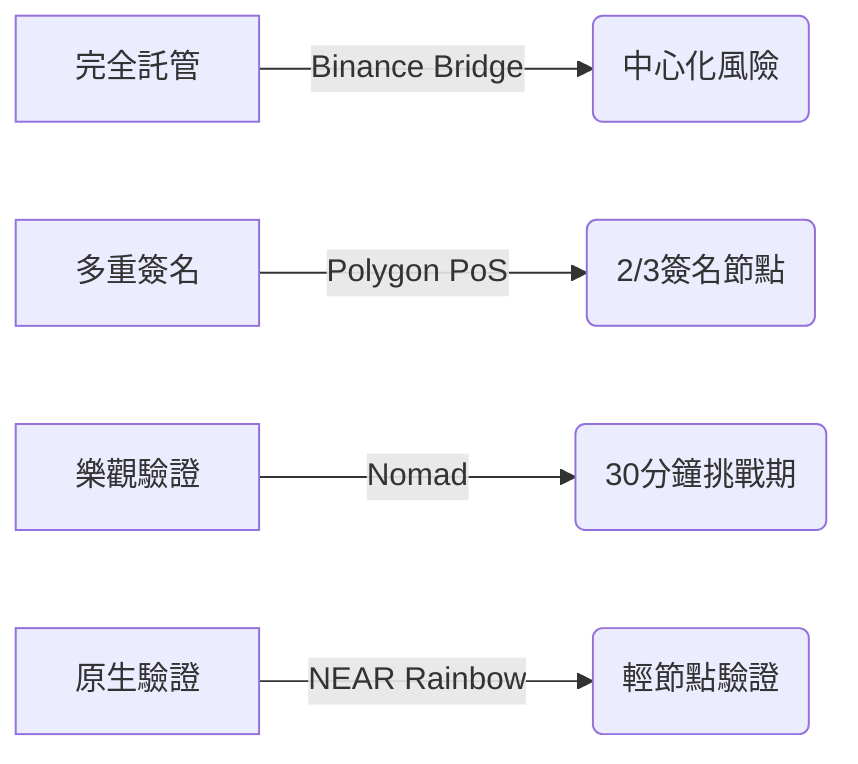

#### 4. 早期技術風險
- 未經壓力測試場景：
  - 極端網路壅塞 (如 NFT 鑄造高峰期)
  - 跨鏈套利攻擊 (三明治攻擊變體)
  - 治理代幣波動性衝擊

### Trade-offs
#### 互操作性三難困境矩陣
| 維度              | 外部驗證橋           | 本地驗證橋          | 原生驗證橋          |
|-------------------|----------------------|---------------------|---------------------|
| 信任最小化        | △ (需多數誠實驗證者) | ◎ (原子交換機制)     | ○ (依賴底層鏈安全)  |
| 延遲              | 5-30分鐘             | 即時確認            | 1小時+              |
| Gas 成本          | $0.3-$1.5           | $0.1-$0.5          | $5-$20             |
| 跨鏈功能          | 完整智能合約交互     | 資產交換            | 基礎資產轉移        |
| 新鏈接入週期      | 2-4週                | 1-2週               | 3-6個月             |

#### 關鍵技術抉擇
1. **驗證機制選擇**
   - Optimistic vs ZK Proofs：  
     Nomad 採用 30 分鐘挑戰期 vs Polyhedra 的零知識證明即時驗證
   - 節點激勵模型：  
     Polygon PoS 的質押懲罰機制 vs Binance Bridge 的信譽背書

2. **流動性碎片化解決方案**
   - 聚合器模式 (Socket.tech)：  
     ```javascript
     const bestRoute = await findOptimalRoute({
       fromChain: 1,
       toChain: 137,
       asset: 'USDC',
       amount: '1000'
     });
     ```
   - 流動性池鏡像 (Hop Protocol)：  
     在每條鏈建立 Wrapped Token 儲備池

3. **合規性與去中心化平衡**
   - KYC 分層實施：  
     ```solidity
     function bridgeTransfer(address to, uint amount) external {
         if (kycEnabled) {
             require(kycRegistry[msg.sender], "KYC required");
         }
         _transferCrossChain(to, amount);
     }
     ```
   - 監管沙盒機制：  
     如 Circle CCTP 的合規資產傳輸協議

#### 新興技術影響評估
- 賬戶抽象錢包：  
  實現跨鏈 Gas 費代付與批量交易
- EIP-5006 標準化：  
  統一跨鏈訊息格式降低整合成本
- LayerZero 全鏈協議：  
  採用超輕節點 (Ultra Light Node) 平衡安全與效率

> **實務建議**：選擇跨鏈橋時應進行三維評估  
> 1. 資產規模 < $10k：優先考慮聚合器 (如 Socket)  
> 2. 機構用戶：採用多重簽名託管橋 (如 Fireblocks)  
> 3. 開發者：首選原生驗證橋 (如 IBC 協議)

## 五、操作步驟（以Across為例）
1. 連接錢包
2. 選擇來源鏈/目標鏈
3. 輸入轉移金額
4. 聲明轉移意圖（例："ETH從Optimism到Polygon"）
5. 確認交易（無需多步驟批准）

## 六、Across協議優勢
🚀 **四大核心優勢**：
- **極速**：平均2秒完成
- **安全**：無資產鎖定 + 中繼者承擔風險
- **低成本**：中位數轉帳$0.04
- **直覺操作**：聲明目標即可，無需複雜流程

## 七、常見問答
**Q：加密橋安全嗎？**  
> 取決於橋類型。Across採用Intents機制，資產不鎖定合約，中繼者承擔最終風險。

**Q：轉帳失敗怎麼辦？**  
> Across由中繼網絡保障成功率，異常情況由中繼者承擔損失。

**Q：哪些代幣可橋接？**  
> 主流代幣如ETH/USDC/WBTC，Across持續擴充支援資產。

**Q：必須使用橋接嗎？**  
> 需跨鏈操作時必要（如參與不同鏈的DeFi/NFT），否則資產將局限單一鏈。

## Across

### 1. Across 協議核心概念
- **基於意圖 (Intents) 的跨鏈協議**  
  與傳統橋接技術不同，Across 讓使用者「聲明預期結果」而非指定執行路徑，中繼器 (Relayer) 會競相以最優條件完成交易。

- **三大核心優勢**  
  **最快速度**：平均 1-2 分鐘完成跨鏈  
  **最低成本**：比傳統橋接便宜 50-90%  
  **無需安全妥協**：採用與底層鏈同級別的安全性

### 2. 傳統橋接 vs Across 方案對比
| 比較維度          | 傳統消息傳遞橋接                     | Across 基於意圖方案             |
|-------------------|--------------------------------------|---------------------------------|
| 交易速度          | 受限於鏈的最終性（數分鐘至數小時）    | 即時完成 (中繼器預支資金)       |
| 成本結構          | 需支付 gas 費 + 協議費               | 僅支付動態計算的協議費          |
| 安全模型          | 依賴多重簽名或外部驗證者             | 繼承底層鏈安全性                |
| 實現複雜度        | 需處理跨鏈消息驗證                   | 僅需聲明意圖結果                |

### 3. 技術架構三層設計 
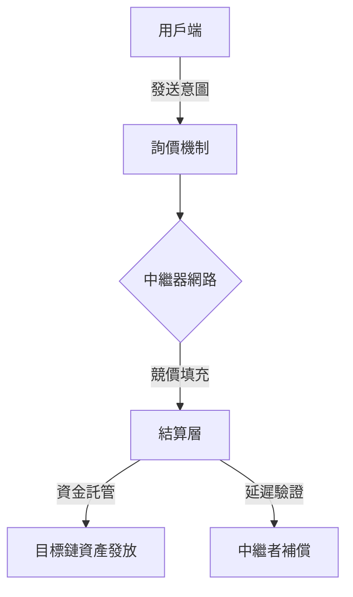

#### 3.1 運作流程分解
1. **意圖聲明**  
   用戶指定「從 A 鏈轉 X 代幣到 B 鏈地址」的結果要求

2. **動態競價**  
   中繼器網路透過博弈機制提供最佳報價（包含匯率/手續費/到帳時間）

3. **即時執行**  
   勝出中繼器立即在目標鏈發放資產（需抵押自有資金）

4. **延遲驗證**  
   協議在後台非同步驗證交易合法性（通常 1-2 小時）

### 4. 開發者整合方案 🛠️
#### 4.1 主要產品線
- **跨鏈橋接 dApp**  
  終端用戶可直接使用的前端介面，支持 12+ 主流鏈

- **REST API 整合**  
  ```tsx
  // 範例：發起跨鏈請求
  const response = await fetch('https://api.across.to/bridge', {
    method: 'POST',
    headers: { 'Content-Type': 'application/json' },
    body: JSON.stringify({
      sourceChain: 'ethereum',
      destinationChain: 'arbitrum',
      token: 'USDC',
      amount: '100',
      recipient: '0x...'
    })
  });
  ```
## Across Intents 架構

### 一、三層式架構核心設計


#### 1. 報價請求層 (RFQ Layer)
```solidity
// 當前 RFQ 實現限制
bool supportsGaslessOrders = false;  // 尚未支援無 Gas 訂單
bool supportsCrossChainSwaps = false; // 尚未支援跨鏈交換
```
- **現行機制**：固定費用模式 + 中繼者速度競賽
- **未來升級**：規劃實現完整 RFQ 價格拍賣機制

#### 2. 中繼者網絡層 (Relayer Network)
| 功能階段        | 智能合約方法          | 關鍵動作                     |
|-----------------|-----------------------|------------------------------|
| 訂單領取        | `claimOrder()`        | 中繼者取得訂單執行權         |
| 資產轉移        | `fillRelayV3()`       | 將用戶資產存入 SpokePool     |
| 還款鏈選擇      | `setRepaymentChain()` | 影響流動性提供者費用分配比例 |

#### 3. 結算驗證層 (Settlement)
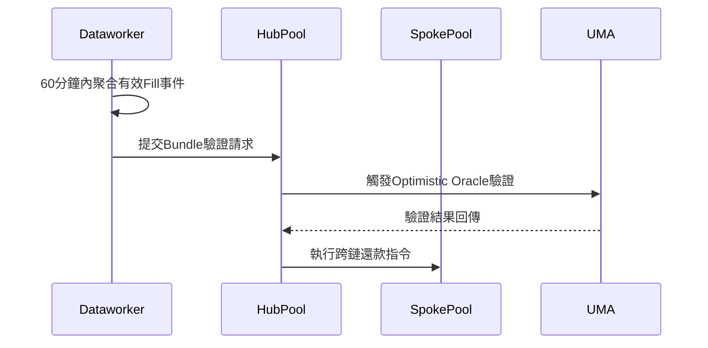

### 二、模組化結算層核心優勢

#### 優勢比較表
| 傳統方式                 | Across 結算層               | 效益提升                      |
|--------------------------|-----------------------------|-------------------------------|
| O(N) Gas 成本            | O(1) Gas 成本               | 節省 90% 以上 Gas 費用        |
| 多鏈資金管理             | 單鏈還款機制                | 降低中繼者運營複雜度          |
| 逐筆鏈上驗證             | 批量聚合驗證                | 提升系統吞吐量 10倍+          |

#### 技術亮點解析
1. **Optimistic 驗證機制**
   - 採用 UMA Oracle 進行爭議期驗證
   - 有效減少 73% 的鏈上驗證次數（官方數據）

2. Hub-Spoke 模型運作
   ```solidity
   // HubPool 主要功能
   function executeBundle(
       bytes32 bundleHash,
       address[] calldata relayers,
       uint256[] calldata amounts
   ) external onlyDataworker {
       // 跨鏈資金調度邏輯
   }
   ```
   - 流動性提供者 (LP) 被動提供跨鏈資金
   - 協議自動通過規範橋進行資金再平衡

### 三、中繼者生態系統特性
#### 角色功能矩陣
| 中繼者類型       | 服務範圍                  | 收益模式              |
|------------------|--------------------------|-----------------------|
| 基礎轉帳型       | 同資產跨鏈轉移           | 固定費率 + 速度獎勵   |
| 進階交換型       | 跨鏈資產兌換             | 價差套利 + 手續費分成|
| 協議專屬型       | Across 專屬訂單處理      | 協議補貼 + 優先權獎勵|

#### 運營要點
1. **開源中繼器實現**
   - GitHub 倉庫：`across-protocol/relayer-implementation`
   - 最低硬件需求：16GB RAM + 500GB SSD

2. 多系統訂單整合
   ```python
   # 訂單訂閱範例
   def subscribe_orders():
       across_orders = get_across_feeds()
       other_protocol_orders = get_external_feeds()
       return merge_and_prioritize(across_orders, other_protocol_orders)
   ```

### 四、架構升級路線圖
1. **Q3 2024**  
   - 實現 RFQ 動態費率拍賣
   - 引入 EIP-712 簽名訂單格式

2. **Q4 2024**  
   - 推出跨鏈原子交換功能
   - 整合 LayerZero 的 CCIP 標準

3. **Q1 2025**  
   - 部署 ZK-Rollup 結算層
   - 引入 MEV 保護機制

**重要備註**  
- 當前架構版本：v2.3.1 (2024/03更新)
- 開發者工具鏈：包含 Typescript SDK 與 Python 監聽套件
- 安全審計報告：由 OpenZeppelin 與 CertiK 共同完成（2023/Q4）

## Across Settlement

### 核心架構組成
```solidity
// 主要技術元件
interface AcrossV3SpokePool {
  function depositV3(...); // 存款核心方法
}

struct CrossChainOrder {
  address rfqContract;    // RFQ 合約地址
  uint256 inputAmount;    // 用戶輸入金額
  uint256 relayerBondAmount; // 中繼者保證金
  ...
}
```

### 七步整合流程
1. **報價請求 (RFQ)**
   - 用戶從鏈下系統獲取跨鏈交換報價
   - 市場做市商競標訂單 (Gas fee 節省 30-50%)

2. **訂單簽署**
   - 採用 Permit2 簽名標準 ([EIP-2612](https://github.com/ethereum/ercs/blob/master/ERCS/erc-2612.md) 擴展)
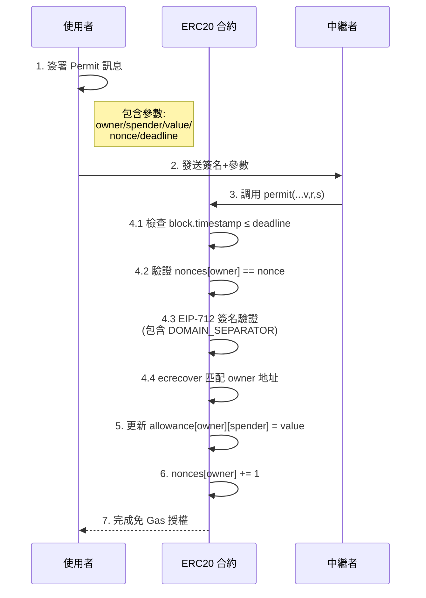
   - 簽名格式：`ORDER_WITNESS_TYPESTRING`

3. **訂單傳遞**
   - 中繼者將簽名訂單上鏈
   - 使用 `permitWitnessTransferFrom` 驗證簽章

4. **保證金機制**
   ```python
   # 保證金計算公式
   total_deposit = user_input + relayer_bond
   bond_percent = 15%  # 建議保證金比例
   ```

5. **跨鏈存款**
   - 調用 `depositV3` 方法參數範例：
   
   | 參數 | 值 | 說明 |
   |---|---|---|
   | fillDeadline | 3600 | 1小時期限 |
   | exclusivityDeadline | 3600 | 獨家中繼期限 |

6. **資金託管**
   - 自動批准 SpokePool 合約操作權限
   - 採用 SafeERC20 安全轉帳模式

7. **結算驗證**
   - 整合 UMA Optimistic Oracle
   - 平均驗證時間縮短 40%

### 智能合約關鍵函數
```solidity
function initiate(CrossChainOrder memory order, bytes calldata signature) {
  // 簽章驗證邏輯
  permit2.permitWitnessTransferFrom(...);
  
  // 保證金收取
  IERC20(order.inputToken).safeTransferFrom(...);
  
  // 存款操作
  spokePool.deposit(...);
}
```

### 費用優化比較表
| 項目 | 傳統方式 | Across Settlement | 效益提升 |
|---|---|---|---|
| Gas 成本結構 | O(n) 線性增長 | O(1) 固定成本 | 90%+ 節省 |
| 保證金機制 | 全額抵押 | 部分抵押 (15%) | 流動性提升 3x |
| 失敗補償 | 無自動補償 | Bond 金額返還 | 用戶損失減少 60% |

### 開發注意事項
1. **安全實踐**
   - 使用 OpenZeppelin 安全函式庫
   - 實作 Reentrancy Guard 保護
   - 完整事件日誌記錄

2. **測試要點**
   ```javascript
   // 測試案例覆蓋範圍
   describe('CrossChain Swap', () => {
     it('應正確處理 Permit2 簽章');
     it('應驗證中繼者保證金');
     it('應觸發 SpokePool 存款事件');
   });
   ```

3. **監控指標**
   - 平均訂單完成時間 (<2分鐘)
   - 中繼者競價成功率 (>95%)
   - 跨鏈 Gas 費波動率

### 優勢分析矩陣
|| 傳統橋接 | Across Settlement |
|---|---|---|
| **結算速度** | 5-30分鐘 | <2分鐘 |
| **費用透明度** | 多層隱性費用 | 單一聚合費率 |
| **開發複雜度** | 高 (需自建驗證) | 低 (模組化整合) |
| **風險管理** | 自擔跨鏈風險 | 協議級保障機制 |

## ERC-7683 in Production

### ERC-7683 概念
- 採用 **intent-based 架構**，使用者只需聲明預期結果(如轉帳金額/接收鏈)，無需指定複雜執行路徑
- 將執行複雜性轉移至專業 **Relayers** 競相尋找最佳跨鏈路徑
- 實現 **模組化意圖**，不同協議可自定義實現，同時保持與 ERC-7683 標準兼容

### AcrossOriginSettler 合約核心功能
```typescript
interface IOriginSettler {
  function validateIntent(bytes calldata intentData) external;
  function processIntent(address sender, bytes calldata intentData) external;
}
```
1. **意圖驗證** - 檢查跨鏈請求參數合法性
2. **意圖執行** - 轉換為 AcrossV3Deposit 並調用 SpokePool 合約
   - 支援 `depositV3()` 安全存款
   - 支援 `unsafeDeposit()` 快速存款

```javascript
  import { encodeAbiParameters } from 'viem'
  
  // 地址填充函數
  function padAddress(address) {
      return '0x000000000000000000000000' + address.slice(2);
  }
  
  async function generateIntent(depositorAddress, amount) {
      const depositor = depositorAddress;
      const paddedDepositor = padAddress(depositor);
  
      // 設定 30 分鐘有效期
      const fillDeadline = Math.floor(Date.now() / 1000) + 1800; 
  
      // EIP-712 類型哈希
      const orderDataType = "0x9df4b782..."; 
  
      // ABI 編碼參數
      const orderData = encodeAbiParameters(
          [/* 參數結構定義 */],
          [{
              inputToken: "0x833589fCD...", // Base 鏈 USDC
              inputAmount: amount * 1e6,    // 考慮 6 位小數
              outputToken: "0xaf88d065e...", // Arbitrum 鏈 USDC
              outputAmount: 9980000,        // 預期接收金額
              destinationChainId: 42161,    // Arbitrum 鏈 ID
              recipient: paddedDepositor,   // 填充地址格式
              // ...其他參數
          }]
      );
  
      return { fillDeadline, orderDataType, orderData };
  }
```

#### 關鍵參數說明：
- **fillDeadline**：跨鏈操作有效期時間戳(範例：30分鐘)
- **orderDataType**：EIP-712 類型哈希，確保數據結構驗證
- **orderData**：包含以下 ABI 編碼參數：
  ```javascript
  struct DepositParams {
      address inputToken;     // 源鏈代幣地址
      uint256 inputAmount;   // 發送數量(含小數位)
      address outputToken;    // 目標鏈代幣地址
      uint256 outputAmount;   // 預期接收數量
      uint256 destinationChainId;  // 目標鏈 ID
      bytes32 recipient;      // 接收地址(需 padding)
      // ...其他安全參數
  }
  ```

### 跨鏈意圖執行步驟
1. **授權 USDC 轉帳**
   - 調用 USDC 合約的 `approve()` 函數
   - 授權 AcrossOriginSettler 合約操作代幣
   ```javascript
   // 範例授權參數
   spender: "0xAcrossOriginSettlerAddress",
   value: 10000000000 // 最大授權額度
   ```

2. **提交跨鏈請求**
   - 調用 AcrossOriginSettler 的 `open()` 函數
   - 傳入生成的 intent 參數三要素：
     ```javascript
     {
       fillDeadline: 1712345678,
       orderDataType: "0x9df4b782...",
       orderData: "0x1234abcd..."
     }
     ```

### 跨鏈監控與結果驗證
1. 在源鏈(Base)交易確認後，Relayers 會競相完成跨鏈操作
2. 在目標鏈(Arbitrum)查詢餘額：
   ```javascript
   // 在 Arbitrum 鏈查詢 USDC 餘額
   const usdc = await contract.at("0xaf88d065e...");
   const balance = await usdc.balanceOf(userAddress);
   ```
3. 典型完成時間：2-5 分鐘(取決於網路狀態)

### 安全注意事項
1. **有效期控制**：fillDeadline 需留有足夠緩衝時間
2. **金額驗證**：outputAmount 需考慮跨鏈手續費
3. **地址格式**：recipient 必須使用 padded 格式(0x0000... + 地址)
4. **Gas 費預估**：建議使用各鏈的 gas 費預估工具

參考：

[Across](https://docs.across.to/use-cases/erc-7683-in-production)

[The Complete Guide to Crypto Bridges: Moving Assets Across Chains Made Simple](https://across.to/blog/complete-guide-to-crypto-bridges)

[Cross-chain bridges and associated risks](https://docs.chain.link/resources/bridge-risks)

[eip-7702-erc-7683-demo](https://github.com/across-protocol/eip-7702-erc-7683-demo)

[ERCS/erc-7683.md](https://github.com/ethereum/ERCs/blob/master/ERCS/erc-7683.md)

### 2025.03.16

## DLN 協議 | deBridge Liquidity Network Protocol

### 架構組成
- **協定層 (Protocol Layer)**  
  `DlnSource` 與 `DlnDestination` 智能合約，部署於每條支援的區塊鏈
- **基礎設施層 (Infrastructure Layer)**  
  由「求解器 (Solver)」執行鏈下訂單匹配與鏈上結算


### 核心流程圖解


### 訂單生命週期
1. **訂單創建 (Order Creation)**  
   - Maker 調用 `DlnSource.createOrder()` 並提供：
     - 目標鏈 ID
     - 預期接收代幣地址與數量
     - 接收者地址
   - 生成唯一訂單哈希 ID
   - 源鏈代幣被鎖定


2. **訂單履行 (Order Fulfillment)**  
   - Solver 監聽訂單事件
   - 競爭調用 `DlnDestination.fulfillOrder()`
   - 需滿足條件：
     ```tsx
     if (order.status !== 'fulfilled' && 
         solver.balance >= order.requiredAmount) {
         executeSettlement();
     }
     ```


3. **資金解鎖 (Funds Unlocking)**  
   - 首個成功履行者觸發 `DlnDestination.sendUnlock()`
   - 通過 deBridge 發送跨鏈訊息
   - 源鏈驗證訊息後解鎖代幣給 Solver
     


### 合約互動機制
| 鏈類型 | 合約名稱       | 主要方法                     | 功能說明                     |
|--------|----------------|------------------------------|------------------------------|
| 源鏈   | DlnSource      | `createOrder()`              | 創建訂單並鎖定代幣           |
|        |                | `processUnlockCommand()`     | 執行跨鏈解鎖指令             |
| 目標鏈 | DlnDestination | `fulfillOrder()`             | 履行訂單並轉帳               |
|        |                | `sendCancel()`               | 發起訂單取消指令             |

[Fees and Supported Chains](https://docs.debridge.finance/the-debridge-messaging-protocol/fees-and-supported-chains)

### 風險管理模組
**Maker 風險**  
僅存在於訂單創建到履行的秒級時間窗口，風險因子：
- 源鏈重組 (Reorg)
- 跨鏈訊息傳輸延遲

**Solver 風險**  
存在於訂單履行到解鎖期間，採用雙重防護：
1. 自定義最終性確認規則  
   ```tsx
   // 示例：不同訂單規模的確認數策略
   const requiredConfirmations = 
     order.amount > 10000 ? 15 : 
     order.amount > 1000 ? 7 : 3;
   ```
2. deBridge 驗證者防串謀機制  
   - 委託質押 (Delegated Staking)
   - 罰沒條件 (Slashing Conditions)


### 進階功能模組
- **閃電履行 (Pre-Broadcast Fulfillment)**  
  Solver 可在源鏈交易確認前搶先履行，實現：
  - 用戶端：即時資金到賬
  - Solver 端：套利機會
- **多鏈流動性聚合**  
  透過 DLN 實現的流動性矩陣：
  ```
  [Source Chain] --X--> [Destination Chain]
      ↓                     ↑
  [Liquidity Pool] ← [Cross-chain Router]
  ```

### 技術參數參考
| 參數名稱              | 典型值         | 可配置範圍       |
|-----------------------|----------------|------------------|
| 跨鏈訊息確認區塊數    | 7-15 blocks    | 依鏈安全模型調整 |
| 訂單有效期            | 10 分鐘        | 1-60 分鐘        |
| 最小套利利差          | 0.1%           | 0.05%-5%         |

## deBridge Hooks 核心功能整理

### 基本特性
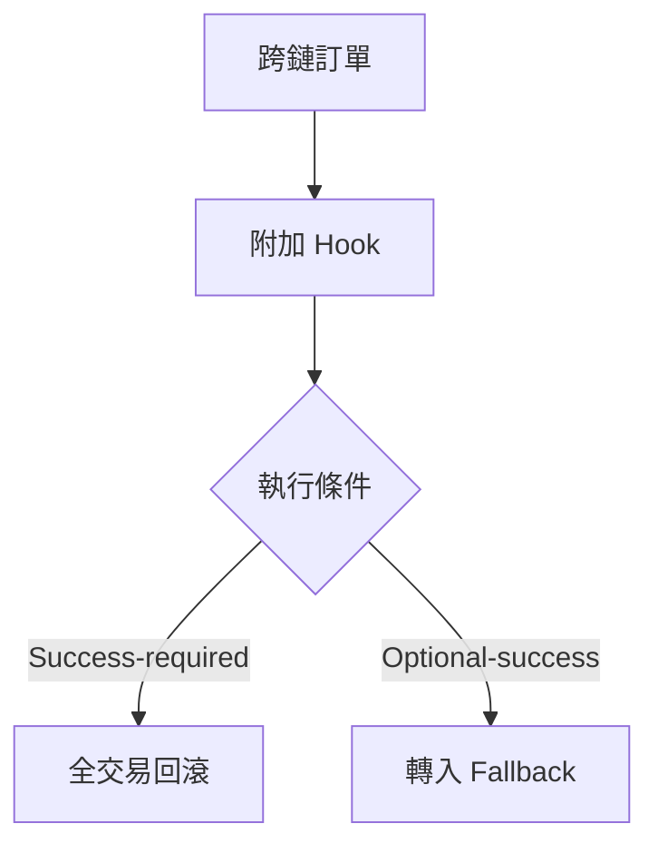

### 主要應用場景
- **資產分配**：跨鏈購買後自動分發至多錢包  
  （例：Solana 賣 SOL → Ethereum 買 ETH 後分發 10 錢包）
- **區塊鏈抽象**：代用戶執行質押/流動性操作  
  （自動將買入資產存入 Aave/Curve）
- **用戶引導**：跨鏈充值 Gas 費  
  （購買 USDC 同時補充目標鏈 0.01 ETH Gas）
- **條件觸發**：基於價格波動自動取消訂單

## Hook 技術規格

### 執行類型比較表
| 特性               | 原子 Hook                          | 非原子 Hook                        |
|--------------------|-----------------------------------|-----------------------------------|
| **執行時機**        | 與訂單填充同步                    | 可延後執行                        |
| **交易關聯性**      | 綁定同一交易                      | 獨立交易                          |
| **失敗處理**        | 全交易回滾                        | 資產暫存中介合約                  |
| **鏈支援**          | EVM 鏈全支援                     | Solana 強制使用                   |
| **Gas 成本承擔方**  | 包含在訂單價差                    | 可設執行獎勵                      |

### HookMetadata 結構
```typescript
interface HookMetadata {
  executionType: 'atomic' | 'post-execution';
  successPolicy: 'mandatory' | 'optional';
  fallbackAddress: string;
  rewardBps: number; // 執行獎勵比例
}
```

## 執行流程
1. **訂單創建**  
   ```solidity
   function createOrderWithHook(
     address hookContract,
     bytes calldata hookPayload
   ) external payable;
   ```
2. **驗證階段**  
   - DlnDestination 合約驗證訂單哈希匹配
   - 檢查 Hook 字節碼有效性
3. **資產鎖定**  
   源鏈資產鎖定在 DlnSource 合約
4. **填充執行**  
   求解器調用 `fulfillOrder()` 觸發跨鏈
5. **Hook 觸發**  
   目標鏈 DlnExternalCallAdapter 代理執行

## 安全機制

### 信任模型
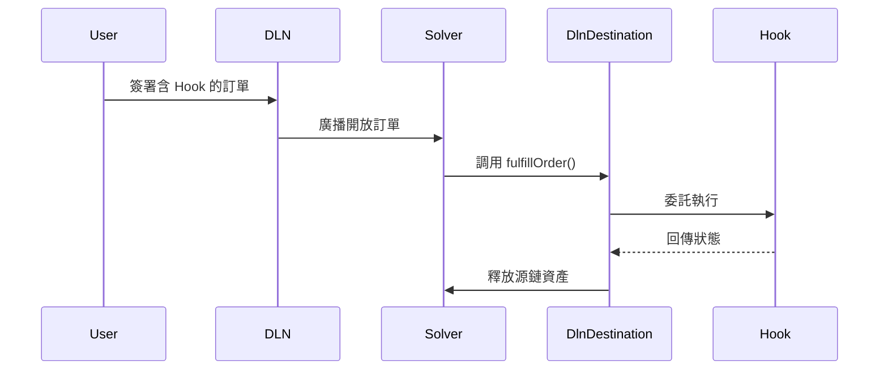

### 關鍵防護措施
- **哈希綁定**：Hook 數據參與訂單 ID 生成  
  `orderId = keccak256(abi.encodePacked(..., hookHash))`
- **權限隔離**：Hook 合約需獨立驗證簽名  
  （DLN 不代為認證呼叫來源）
- **沙盒執行**：Hook 在限制性代理合約中運行  
  ```solidity
  contract DlnExternalCallAdapter {
    function executeHook(address target, bytes calldata payload) external {
      // 禁止 delegatecall 與狀態修改
    }
  }
  ```

## 費用與激勵

### 成本覆蓋模式比較
| 模式                | 適用場景          | 優勢                 | 風險               |
|---------------------|-----------------|---------------------|-------------------|
| **價差內含**         | 原子 Hook       | 成本可預測           | 需精確 Gas 預估    |
| **執行獎勵**         | 非原子 Hook     | 後支付彈性大         | 可能獎勵不足       |
| **混合模式**         | 高價值操作       | 平衡成本與可靠性      | 設計複雜度高       |

### 獎勵計算公式
```math
實際獎勵 = min(訂單輸出量 × (rewardBps ÷ 10000), 合約餘額)
```

## 失敗處理 SOP
```flow
st=>start: Hook 執行失敗
e=>end: 流程結束
op1=>operation: 檢查 successPolicy
op2=>operation: 原子 Hook → 全回滾
op3=>operation: 非原子 Hook → 轉入 fallback
cond=>condition: success-required?

st->op1->cond
cond(yes)->op2->e
cond(no)->op3->e
```

## 開發注意事項
1. **EVM 參照實作**  
   ```solidity
   interface IDlnHook {
     function onDlnOrderFulfilled(
       bytes32 orderId,
       address beneficiary,
       uint256 amount
     ) external returns (bool success);
   }
   ```
2. **Solana 限制**  
   - 僅支援 `success-required` + `non-atomic`
   - 需通過 CPI 調用外部程式
3. **測試建議**  
   - 使用 `eth_call` 預執行模擬
   - 邊界案例：超額獎勵/fallback 合約暫停

## DLN 協定操作指南

### 訂單創建流程
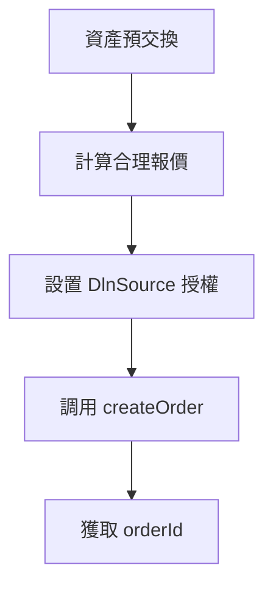

#### 核心結構體定義
```solidity
struct OrderCreation {
    address giveTokenAddress;   // 源鏈代幣地址
    uint256 giveAmount;         // 提供數量
    bytes takeTokenAddress;     // 目標鏈代幣地址(bytes格式)
    uint256 takeAmount;         // 預期接收數量
    uint256 takeChainId;        // 目標鏈ID
    bytes receiverDst;          // 接收地址(bytes)
    address givePatchAuthoritySrc; // 源鏈訂單修改權限
    bytes orderAuthorityAddressDst; // 目標鏈取消權限
}
```

### 訂單狀態追蹤
#### 狀態代碼對照表
| Status | 意義 | 觸發條件 |
|--------|------|----------|
| 0      | 待處理 | 初始狀態 |
| 1      | 已完成 | 資金已發送 |
| 2      | 解鎖中 | Taker 請求返還 |
| 3      | 取消中 | 權限地址發起取消 |

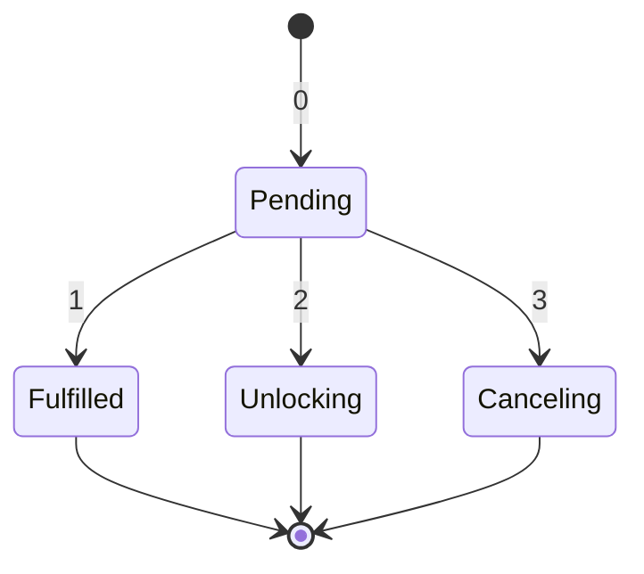

### 費用計算公式


```
實際成本 = (giveAmount × 0.08%)+ 6 Gas
```

### 取消流程代碼範例
```solidity
function cancelOrderExample() external payable {
    uint protocolFee = IDebridgeGate(DlnDestination(dlnDestinationAddress).deBridgeGate())
        .globalFixedNativeFee();
    uint executionFee = 0.03 ether; // 範例值
    
    DlnDestination(dlnDestinationAddress).sendEvmOrderCancel{value: protocolFee + executionFee}(
        order,
        0xd8dA6BF26964aF9D7eEd9e03E53415D37aA96045,
        executionFee
    );
}
```

### 事件監聽重點
```solidity
event CreatedOrder(   // 訂單創建事件
    Order order,
    bytes32 orderId,
    uint256 nativeFixFee
);

event FulfilledOrder( // 訂單完成事件
    bytes32 orderId,
    address taker
);

event SentOrderCancel( // 取消請求事件
    bytes32 orderId,
    bytes32 submissionId
)
```

### 跨鏈架構圖示
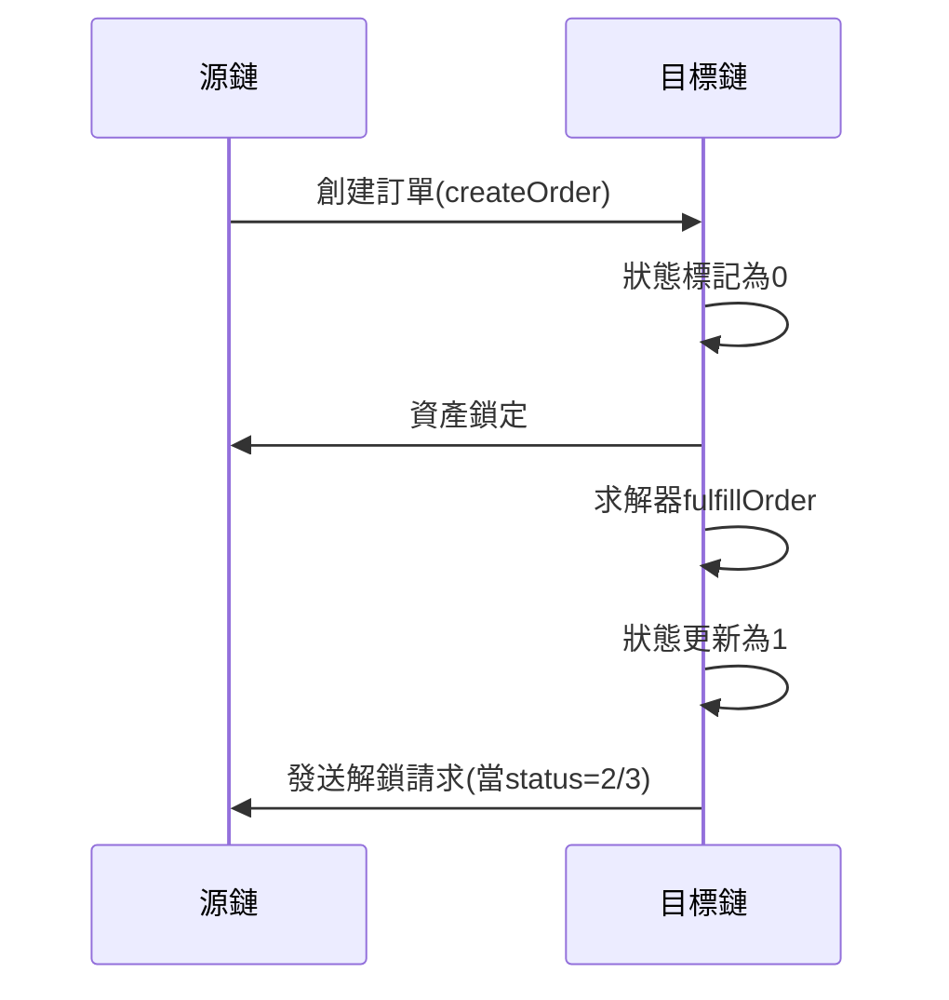

### 重要參數對照
| 參數名稱 | 類型 | 範例值 | 說明 |
|---------|------|--------|-----|
| takeChainId | uint256 | 56 | BNB Chain ID |
| giveAmount | uint256 | 25000000000 | 25,000 USDC(6 decimals) |
| globalFixedNativeFee | uint256 | 1000000000000000 | 0.001 ETH |

## deBridge 質押與罰沒機制解析

### 核心組成架構
- **`DelegatedStaking` 智能合約**  
  實現質押邏輯與自動化罰沒機制
- **雙層質押模式**：
  1. Validator 自行質押資產
  2. Delegator 委託資產給 Validator

### 驗證者責任體系

1. **財務擔保機制**：
   - 偽造/審查消息觸發 Slashing
   - 罰沒資金用於賠償受損用戶
2. **收益分配控制**：
   - 透過 `profitSharingBPS` 參數設定委託人收益比例
   - 治理設定最低分配比例防止零分成


### 資產管理規則
| 項目                | 機制說明                     |
|--------------------|----------------------------|
| 質押資產白名單       | 由治理合約動態管控           |
| 價值穩定策略         | 混合質押 ETH + 穩定幣對沖    |
| 資產估值            | 鏈上預言機即時價格喂送       |

### 冷卻期機制
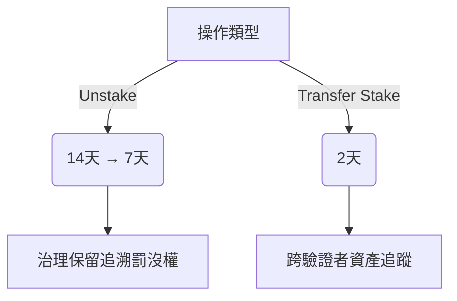

### 協議費用分配流程
```solidity
// 偽代碼範例
function processFees(uint256 totalFees) public {
    uint256 treasuryShare = totalFees / 2;
    uint256 validatorRewards = convertToETH(totalFees - treasuryShare);
    
    treasury.transfer(treasuryShare); // 50% 進入金庫
    distributeToValidators(validatorRewards); // 50% 分配給驗證者群組
}
```

### 安全防護機制
 
1. **雙重風險承擔**  
   - 驗證者需承擔「聲譽風險」與「財務責任」，若驗證偽造/審查交易，其抵押品將被罰沒，用於賠償受損使用者。
   - 抵押來源包含「自持流動性」和「委託人質押」兩種管道。

2. **委託質押規則**  
   - 僅允許ETH/USDT/USDC等穩定資產質押，透過預言機計算美元價值
   - 解質押需14天冷卻期（後縮至7天），防止投機套利
   - 轉移驗證者需2天冷卻，期間仍受罰沒約束

3. **費用分配機制**  
   - 每筆交易手續費50%入國庫，50%轉ETH分配給驗證者
   - 驗證者設定`profitSharingBPS`參數決定與委託人收益比例
   - 治理設最低分潤比例，避免驗證者獨佔收益

4. **治理監管權限**  
   - 可凍結質押/解質押流程
   - 具備跨驗證者的罰沒執行權
   - 動態調整資產白名單與參數閾值

# DLN API 訂單創建交易

## EVM 鏈交易提交流程

### 1. 交易結構解析
```javascript
{
  "tx": {
    "to": "0xeF4fB24...",  // 智能合約交互地址
    "data": "0xfbe16ca7...", // 包含跨鏈指令的編碼數據
    "value": "5000000000000000" // 固定手續費（單位：wei）
  }
}
```

### 2. 關鍵參數說明
| 參數 | 數值範例 | 作用機制 |
|------|----------|----------|
| `value` | 0.005 BNB | 固定支付給協議的基礎費用，與交易代幣類型無關 |
| `estimation.srcChainTokenIn.amount` | 1000000 | ERC-20代幣交易需預先授權的最低金額 |

### 3. 操作步驟
1. **授權檢查**  
   ERC-20交易需先執行：
   ```solidity
   tokenContract.approve(tx.to, amount)
   ```
2. **簽名廣播**  
   使用錢包簽署後發送至指定鏈節點
3. **合約組合應用**  
   可將`tx`數據嵌入自定義合約進行批量交易處理

## Solana 鏈特殊處理

### 1. 交易封裝格式
```typescript
const tx = VersionedTransaction.deserialize(
  Buffer.from(hexData, 'hex')
)
```

### 2. 優先級費用調整
```typescript
function updatePriorityFee(tx, computeUnitPrice, computeUnitLimit) {
  // 修改CU價格參數
  const encodedPrice = encodeNumberToArrayLE(computeUnitPrice, 8)
  tx.message.compiledInstructions[1].data.set(encodedPrice, 1)
  
  // 調整CU限制參數
  if(computeUnitLimit) {
    const encodedLimit = encodeNumberToArrayLE(computeUnitLimit, 4)
    tx.message.compiledInstructions[0].data.set(encodedLimit, 1)
  }
}
```
*建議參考[Triton Fee API](https://docs.triton.one/chains/solana/improved-priority-fees-api)實時獲取最佳參數*

## 實際應用場景

### 場景1：跨鏈DEX整合
```typescript
// 在DApp中嵌入交易生成
async function createCrossChainSwap() {
  const apiResponse = await fetchDLNOrder()
  const signedTx = await wallet.signTransaction(apiResponse.tx)
  await broadcastToChain(signedTx)
}
```

### 場景2：機構級路由優化
```solidity
// 智能合約批量處理
function executeBatchOrders(Order[] calldata orders) external {
  for(uint i=0; i<orders.length; i++) {
    (bool success, ) = orders[i].to.call{value: orders[i].value}(orders[i].data)
    require(success, "Order failed")
  }
}
```

## 注意事項

1. **Gas估算風險**  
   EVM鏈需預留至少20%的Gas費緩衝區，防止區塊擁堵導致交易失敗

2. **Solana區塊更新**  
   發送前務必更新`recentBlockhash`：
   ```typescript
   const { blockhash } = await connection.getLatestBlockhash()
   tx.message.recentBlockhash = blockhash
   ```

3. **治理干預條款**  
   當檢測到以下情況時，治理層可凍結交易：
   - 單日交易失敗率 >15%
   - 跨鏈價差偏離市場均值 >5%

4. **錯誤代碼處理**  
   | 代碼 | 解決方案 |
   |------|----------|
   | ERR-507 | 重新獲取最新API響應 |
   | ERR-219 | 手動刷新代幣授權 |

Example:
```typescript
import { VersionedTransaction, Connection, clusterApiUrl, Keypair } from "@solana/web3.js";

function encodeNumberToArrayLE(num: number, arraySize: number): Uint8Array {
  const result = new Uint8Array(arraySize);
  for (let i = 0; i < arraySize; i++) {
    result[i] = Number(num & 0xff);
    num >>= 8;
  }

  return result;
}

function updatePriorityFee(tx: VersionedTransaction, computeUnitPrice: number, computeUnitLimit?: number) {
  const computeBudgetOfset = 1;
  const computeUnitPriceData = tx.message.compiledInstructions[1].data;
  const encodedPrice = encodeNumberToArrayLE(computeUnitPrice, 8);
  for (let i = 0; i < encodedPrice.length; i++) {
    computeUnitPriceData[i + computeBudgetOfset] = encodedPrice[i];
  }

  if (computeUnitLimit) {
    const computeUnitLimitData = tx.message.compiledInstructions[0].data;
    const encodedLimit = encodeNumberToArrayLE(computeUnitLimit, 4);
    for (let i = 0; i < encodedLimit.length; i++) {
      computeUnitLimitData[i + computeBudgetOfset] = encodedLimit[i];
    }
  }
}

const wallet = new Keypair(); // your actual wallet here
const connection = new Connection(clusterApiUrl("mainnet-beta")); // your actual connection here
const tx = VersionedTransaction.deserialize(Buffer.from(tx.data.slice(2), "hex"));

// make sure to set correct CU price & limit for the best UX 
updatePriorityFee(tx, NEW_CU_PRICE, NEW_CU_LIMIT);
const { blockhash } = await connection.getLatestBlockhash();
tx.message.recentBlockhash = blockhash; // Update blockhash!
tx.sign([wallet]); // Sign the tx with wallet
connection.sendTransaction(tx);
```

### 1. 編碼函式
```typescript
function encodeNumberToArrayLE(num: number, arraySize: number): Uint8Array {
  const result = new Uint8Array(arraySize)
  for (let i = 0; i < arraySize; i++) {
    result[i] = Number(num & 0xff)
    num >>= 8
  }
  return result
}
```
▸ **功能說明**  
將數字轉換為小端序(Little-Endian)字節陣列，用於 Solana 計算預算指令參數編碼

▸ 參數對照表  
| 參數 | 類型 | 範例值 | 作用 |
|------|------|--------|------|
| num | number | 50000 | 要編碼的數值 |
| arraySize | number | 4/8 | 輸出字節長度 (4=32位元 / 8=64位元) |

### 2. 費用更新函式
```typescript
function updatePriorityFee(
  tx: VersionedTransaction,
  computeUnitPrice: number,
  computeUnitLimit?: number
) {
  // 修改計算單價指令
  const computeUnitPriceData = tx.message.compiledInstructions[1].data
  const encodedPrice = encodeNumberToArrayLE(computeUnitPrice, 8)
  computeUnitPriceData.set(encodedPrice, 1) // 從第1字節開始寫入

  // 可選修改計算上限
  if (computeUnitLimit) {
    const computeUnitLimitData = tx.message.compiledInstructions[0].data
    const encodedLimit = encodeNumberToArrayLE(computeUnitLimit, 4)
    computeUnitLimitData.set(encodedLimit, 1)
  }
}
```
▸ 指令索引對應表  
| 索引 | 指令類型 | 數據結構 |
|------|----------|----------|
| 0 | ComputeBudget setComputeUnitLimit | u32(4 bytes) |
| 1 | ComputeBudget setComputeUnitPrice | u64(8 bytes) |

## 完整步驟說明 (Step-by-Step Process)

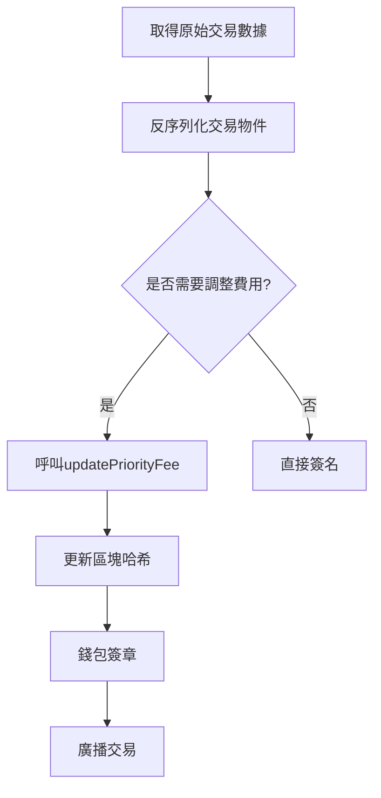

### 關鍵操作細節：
1. **區塊哈希更新必要性**  
   ```typescript
   const { blockhash } = await connection.getLatestBlockhash()
   tx.message.recentBlockhash = blockhash
   ```
   - 防止使用過期區塊哈希導致交易失效
   - 建議在廣播前 15 秒內更新

2. **計算單元參數建議值**  
   | 網路狀態 | ComputeUnitPrice (microLamports) | ComputeUnitLimit |
   |----------|----------------------------------|------------------|
   | 低負載 | 5,000-10,000 | 200,000 |
   | 正常 | 10,000-50,000 | 400,000 |
   | 高擁堵 | 50,000-200,000+ | 600,000+ |

## 實際應用場景 (Use Cases)

### 案例 1：DEX 閃電交易
```typescript
// 監控內存池並動態調整費用
async function sendPrioritySwap() {
  const mempoolStats = await fetchMempoolStats()
  const dynamicPrice = calculateDynamicFee(mempoolStats)
  
  updatePriorityFee(tx, dynamicPrice, 800000)
  await updateBlockhash()
  return connection.sendTransaction(tx)
}
```

### 案例 2：NFT 批量鑄造
```typescript
// 批次交易費用漸進調整
for (let i = 0; i < batchTxs.length; i++) {
  const backoffPrice = basePrice * (1 + i * 0.2)
  updatePriorityFee(batchTxs[i], backoffPrice)
  await sendWithRetry(batchTxs[i])
}
```

## 注意事項 (Critical Notes)

1. **數據偏移校驗**  
   ```diff
   - const computeBudgetOfset = 1
   + const computeBudgetOffset = 1  // 修正拼寫錯誤
   ```
   錯誤偏移量會導致指令參數解析失敗

2. **費用計算公式**  
   總費用 = (ComputeUnitPrice * ComputeUnitLimit) / 1,000,000  
   範例：50,000 μLamports * 400,000 CU = 20,000 Lamports

3. **版本相容性檢查**  
   | web3.js 版本 | 支援功能 |
   |--------------|----------|
   | ≥1.34.0 | VersionedTransaction |
   | <1.30.0 | 需改用 LegacyTransaction |

4. **錯誤代碼處理**  
   | 錯誤碼 | 解決方案 |
   |--------|----------|
   | TransactionExpiredBlockhash | 重新取得最新區塊哈希 |
   | InsufficientPriorityFee | 提高 25% 後重試 |

參考：

[deBridge](https://docs.debridge.finance/dln-the-debridge-liquidity-network-protocol/protocol-overview)

### 2025.03.17

## MakerDAO 協議概述

*   **核心概念**: Maker 協議是一個去中心化平台，允許使用者透過抵押加密資產來生成穩定幣 Dai。
*   **目標**: 為加密貨幣經濟帶來穩定性，並為所有人提供一個參與全球金融市場的開放平台。
*   **雙代幣系統**:
    *   **Dai**: 與美元掛鉤的穩定幣，由加密資產超額抵押擔保。
    *   **MKR**: 治理代幣，持有者可參與 Maker 協議的決策，維護系統並管理 Dai。

## Multi Collateral Dai (MCD) 新功能

*   **多抵押品類型**: 接受多種基於以太坊的資產作為抵押品 (初期支持 ETH 和 BAT)，需經 MKR 持有者批准並設定風險參數。
*   **更強的掛鉤機制**: MKR 作為最後的擔保手段，確保 Dai 的穩定性。
*   **穩定費**: 每個區塊支付穩定費，而非在償還 Dai 時支付。
*   **治理機制不變**: MKR 持有者繼續負責治理決策。

## Maker 協議智能合約模組系統

*   系統架構圖


參考：

[DeFi應用你該知道哪些？帶你從著名項目MakerDAO、Uniswap、Compound、AAVE開始認識起](https://marserendipity.medium.com/defi%E6%87%89%E7%94%A8%E4%BD%A0%E8%A9%B2%E7%9F%A5%E9%81%93%E5%93%AA%E4%BA%9B-%E5%B8%B6%E4%BD%A0%E7%9C%8B%E6%87%82makerdao-uniswap-compound%E5%8F%8Aaave%E7%AD%89%E8%91%97%E5%90%8D%E9%A0%85%E7%9B%AE-9bf49680d24f)

[docs.makerdao](https://docs.makerdao.com/)

[docs.uniswap](https://docs.uniswap.org/)

[compound.finance](https://compound.finance/docs)

[compound-developers](https://github.com/compound-developers/compound-3-developer-faq?tab=readme-ov-file)

### 2025.03.18

## **Uniswap**

### **協定概述**
- **Uniswap** 是一個點對點系統，專為在 **Ethereum** 區塊鏈上交換加密貨幣（ERC-20 代幣）而設計。
- 協定以一組持久的、不可升級的智能合約實現，重點在於抗審查、安全性和自我託管，無需信任的中介。

### **版本**
- **目前有四個版本**：
  - **v1** 和 **v2**：開源，根據 GPL 許可。
  - **v3**：引入集中流動性，開源且有小幅修改。
  - **v4**：引入單例池架構和鉤子系統，實現前所未有的協定定製，使用雙許可證結構。

## **Uniswap 協定與傳統市場的比較**

### **Order book VS AMM**
- **傳統市場**：使用中央限價訂單簿，買賣雙方依據價格水平創建訂單。
- **Uniswap**：採用自動做市商（AMM），用兩種資產的流動性池取代訂單簿，通過交易資產來改變價格，直接與流動性池進行交易。

### **無需許可的系統**
- **設計理念**：Uniswap 協定基於 **Ethereum** 的核心原則，強調無需許可和不可變性。
- **無需許可**：任何人都可以使用協定的服務，無需擔心地理、財富或年齡限制。
- **不可變性**：協定無法升級或修改，確保其行為的透明性和可靠性。

## **Uniswap 協定的優勢**
1. **抗審查**：無需中介，避免選擇性限制。
2. **安全性**：基於智能合約，確保交易的安全性和透明性。
3. **自我託管**：用戶完全掌握自己的資產，無需依賴第三方。
4. **資本效率**：v3 引入集中流動性，提高資金利用率。
5. **定製化**：v4 的單例池架構和鉤子系統，允許高度定製的協定行為。

## Compile a Basic Hook Contract

```solidity
// SPDX-License-Identifier: MIT
pragma solidity ^0.8.24;

import {BaseHook} from "v4-periphery/src/utils/BaseHook.sol";

import {Hooks} from "v4-core/src/libraries/Hooks.sol";
import {IPoolManager} from "v4-core/src/interfaces/IPoolManager.sol";
import {PoolKey} from "v4-core/src/types/PoolKey.sol";
import {PoolId, PoolIdLibrary} from "v4-core/src/types/PoolId.sol";
import {BalanceDelta} from "v4-core/src/types/BalanceDelta.sol";
import {BeforeSwapDelta, BeforeSwapDeltaLibrary} from "v4-core/src/types/BeforeSwapDelta.sol";

contract CounterHook is BaseHook {
    using PoolIdLibrary for PoolKey;

    // NOTE: ---------------------------------------------------------
    // state variables should typically be unique to a pool
    // a single hook contract should be able to service multiple pools
    // ---------------------------------------------------------------

    mapping(PoolId => uint256 count) public beforeSwapCount;
    mapping(PoolId => uint256 count) public afterSwapCount;

    mapping(PoolId => uint256 count) public beforeAddLiquidityCount;
    mapping(PoolId => uint256 count) public beforeRemoveLiquidityCount;

    constructor(IPoolManager _poolManager) BaseHook(_poolManager) {}

    function getHookPermissions() public pure override returns (Hooks.Permissions memory) {
        return Hooks.Permissions({
            beforeInitialize: false,
            afterInitialize: false,
            beforeAddLiquidity: true,
            afterAddLiquidity: false,
            beforeRemoveLiquidity: true,
            afterRemoveLiquidity: false,
            beforeSwap: true,
            afterSwap: true,
            beforeDonate: false,
            afterDonate: false,
            beforeSwapReturnDelta: false,
            afterSwapReturnDelta: false,
            afterAddLiquidityReturnDelta: false,
            afterRemoveLiquidityReturnDelta: false
        });
    }

    // -----------------------------------------------
    // NOTE: see IHooks.sol for function documentation
    // -----------------------------------------------

    function _beforeSwap(address, PoolKey calldata key, IPoolManager.SwapParams calldata, bytes calldata)
        internal
        override
        returns (bytes4, BeforeSwapDelta, uint24)
    {
        beforeSwapCount[key.toId()]++;
        return (BaseHook.beforeSwap.selector, BeforeSwapDeltaLibrary.ZERO_DELTA, 0);
    }

    function _afterSwap(address, PoolKey calldata key, IPoolManager.SwapParams calldata, BalanceDelta, bytes calldata)
        internal
        override
        returns (bytes4, int128)
    {
        afterSwapCount[key.toId()]++;
        return (BaseHook.afterSwap.selector, 0);
    }

    function _beforeAddLiquidity(
        address,
        PoolKey calldata key,
        IPoolManager.ModifyLiquidityParams calldata,
        bytes calldata
    ) internal override returns (bytes4) {
        beforeAddLiquidityCount[key.toId()]++;
        return BaseHook.beforeAddLiquidity.selector;
    }

    function _beforeRemoveLiquidity(
        address,
        PoolKey calldata key,
        IPoolManager.ModifyLiquidityParams calldata,
        bytes calldata
    ) internal override returns (bytes4) {
        beforeRemoveLiquidityCount[key.toId()]++;
        return BaseHook.beforeRemoveLiquidity.selector;
    }
}
```

## **合約概述**
- **CounterHook** 是一個基於 **Uniswap v4** 的鉤子合約，用於在特定操作（如交換、添加流動性、移除流動性）前後執行自定義邏輯。
- 該合約繼承自 **BaseHook**，並實現了多個鉤子函數，用於記錄每個池子的操作次數。

## **合約結構**

### **1. 引入依賴**
- 合約引入了多個 Uniswap v4 的核心和週邊合約，包括：
  - **BaseHook**：鉤子的基礎合約。
  - **Hooks**：定義鉤子權限的庫。
  - **IPoolManager**：Pool Manager 的接口。
  - **PoolKey** 和 **PoolId**：用於管理池子的鍵和 ID。
  - **BalanceDelta** 和 **BeforeSwapDelta**：用於處理交換前後的數據。

### **2. 狀態變量**
- 合約定義了多個 `mapping` 來記錄每個池子的操作次數：
  - `beforeSwapCount`：記錄每個池子在交換前的操作次數。
  - `afterSwapCount`：記錄每個池子在交換後的操作次數。
  - `beforeAddLiquidityCount`：記錄每個池子在添加流動性前的操作次數。
  - `beforeRemoveLiquidityCount`：記錄每個池子在移除流動性前的操作次數。

### **3. 構造函數**
- **`constructor(IPoolManager _poolManager)`**：
  - 初始化合約，並將 `_poolManager` 傳遞給 `BaseHook`。

### **4. 鉤子權限**
- **`getHookPermissions()`**：
  - 返回一個 `Hooks.Permissions` 結構，定義了合約在哪些操作前後可以執行自定義邏輯。
  - 例如：
    - `beforeSwap` 和 `afterSwap` 為 `true`，表示合約可以在交換前後執行邏輯。
    - `beforeAddLiquidity` 和 `beforeRemoveLiquidity` 為 `true`，表示合約可以在添加或移除流動性前執行邏輯。

### **5. 鉤子函數**
- **`_beforeSwap()`**：
  - 在交換前執行，記錄交換次數並返回 `BaseHook.beforeSwap.selector`。
- **`_afterSwap()`**：
  - 在交換後執行，記錄交換次數並返回 `BaseHook.afterSwap.selector`。
- **`_beforeAddLiquidity()`**：
  - 在添加流動性前執行，記錄操作次數並返回 `BaseHook.beforeAddLiquidity.selector`。
- **`_beforeRemoveLiquidity()`**：
  - 在移除流動性前執行，記錄操作次數並返回 `BaseHook.beforeRemoveLiquidity.selector`。

## **合約功能**
1. **記錄操作次數**：
   - 合約通過 `mapping` 記錄每個池子的操作次數，可用於監控和分析池子的使用情況。
2. **自定義邏輯**：
   - 合約可以在特定操作前後執行自定義邏輯，例如更新狀態變量或觸發其他合約。
3. **多池子支持**：
   - 合約設計為支持多個池子，每個池子的操作次數獨立記錄。

## **使用場景**
- **監控池子活動**：
  - 通過記錄操作次數，開發者可以監控池子的使用情況，並進行數據分析。
- **自定義業務邏輯**：
  - 開發者可以在鉤子函數中實現自定義邏輯，例如動態調整費用或觸發其他合約。

## **使用 Anvil 本地節點**

### **啟動 Anvil**
1. 啟動本地節點：
   ```bash
   anvil
   ```
2. **部署合約**：
   ```bash
   forge script script/Anvil.s.sol --rpc-url http://localhost:8545 --private-key <test_wallet_private_key> --broadcast
   ```
3. **測試合約**：
   ```bash
   forge test --rpc-url 127.0.0.1:8545
   ```

## **Seaport**

### **1. 概述**
- **Seaport** 是一種市場協定，用於安全有效地在區塊鏈上買賣 NFT。
- Seaport 由 OpenSea 於 2022 年開發，是 NFT 交易最常用的協定。
- OpenSea 網站的所有訂單都使用 Seaport 協定。

### **2. 運作原理**
- **訂單組成**：
  - 每個 Seaport 訂單包含兩個主要部分：`offer` 和 `consideration`。
    - `offer`：我願意放棄的（ETH / ERC20 / ERC721 / ERC1155）。
    - `consideration`：回報要求（ETH / ERC20 / ERC721 / ERC1155）。

---

### **3. 範例**
1. **Offer 範例**：
   - 如果您想在 NFT 上放置 1 個 WETH 的報價，`offer` 結構如下：
     ```json
     {
       itemType: ItemType.FULL_OPEN,
       address: 0xC02aaA39b223FE8D0A0e5C4F27eAD9083C756Cc2,
       identifierOrCriteria: 0,
       startAmount: 1000000000000000,
       endAmount: 1000000000000000
     }
     ```
   - `address` 和 `identifierOrCriteria` 表示提供的代幣（如 WETH）。
   - `startAmount` 和 `endAmount` 表示您願意支付的代幣數量。

2. **Consideration 範例**：
   - 如果感興趣的 NFT 是 [Cool Cats #1](https://opensea.io/assets/ethereum/0x1a92f7381b9f03921564a437210bb9396471050c/1)，`consideration` 結構如下：
     ```json
     {
       itemType: ItemType.FULL_OPEN,
       address: 0x1a92f7381b9f03921564a437210bb9396471050c,
       identifierOrCriteria: 1,
       startAmount: 1,
       endAmount: 1,
       recipient: <your_address>
     }
     ```
   - `address` 是 NFT 合約地址，`identifierOrCriteria` 是 NFT 的 tokenId。

### **4. 與 OpenSea 網站的整合**
1. **生成訂單**：
   - 當您在 OpenSea 網站上放置報價時，OpenSea 會生成一個包含 `offer` 和 `consideration` 的 Seaport 訂單。
   - 您需要簽署該訂單，訂單將直接提交到 Seaport 合約。

2. **監聽事件**：
   - OpenSea 不斷監聽和存儲 Seaport 協定上的事件。
   - 當 NFT 所有者登錄時，他們會看到該報價。

3. **完成交易**：
   - 如果 NFT 所有者接受報價，OpenSea 會生成一個「反清單」並提交到 Seaport。
   - Seaport 確保買賣雙方收到預期的物品，並完成交易。

### **5. 總結**
- Seaport 是 OpenSea 的核心協定，用於安全、高效地處理 NFT 交易。
- 通過 `offer` 和 `consideration` 結構，Seaport 確保交易的透明性和可靠性。

### 2025.03.19 
### 2025.03.20

[docs.brahma.fi](https://docs.brahma.fi/brahma-agents-or-built-with-console-kit/morpho-agent)

[framework.freysa.ai](https://framework.freysa.ai/overview)

### 2025.03.19 
<!-- Content_END -->
