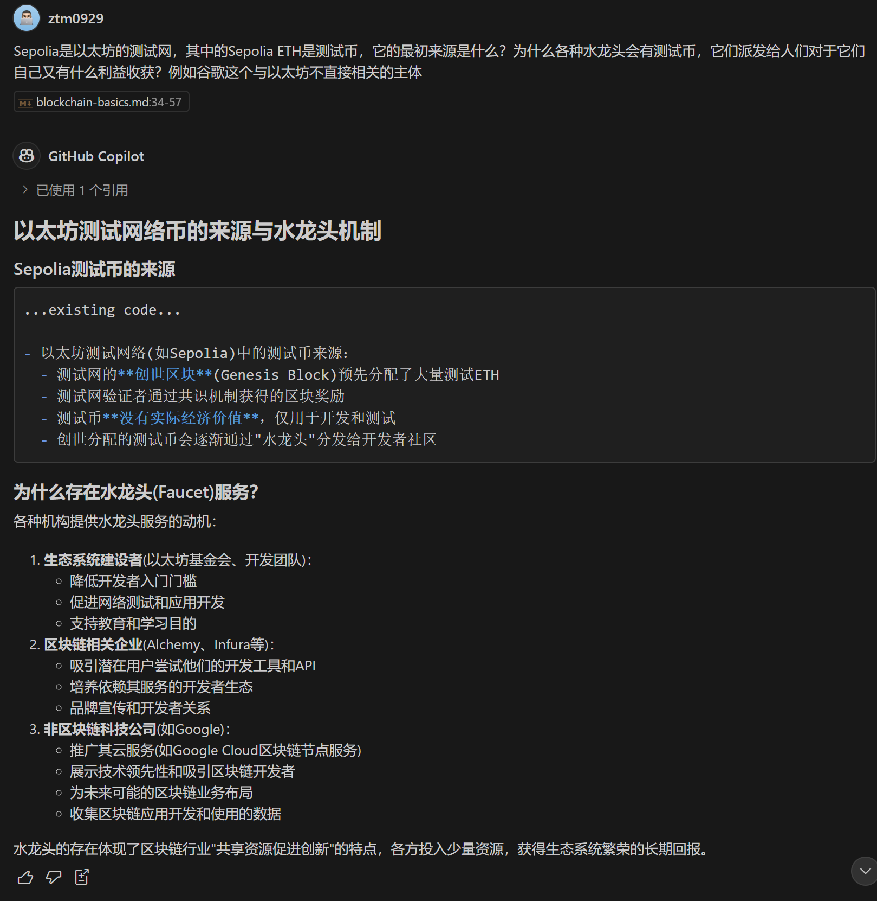

> 请在上边的 timezone 添加你的当地时区(UTC)，这会有助于你的打卡状态的自动化更新，如果没有添加，默认为北京时间 UTC+8 时区

# Kevin

1. 一个学生，一个编程小白
2. 有信心完成本次共学
3. https://t.me/ztm0929

## Notes

<!-- Content_START -->

### 2025.02.27

本次共学活动有一个 LXPU 激励，本小白完全不懂这是什么，我可以如何与它交互，也许可以趁着这次学习详细了解下。

根据[说明](https://lxdao.notion.site/LXDAO-Q-A-b77d0c920acc408caec0b26ea5c5efec)，LXPU 是 LXP + U ，1000 LXPU = 800 USD + 200 LXP

USD 好理解，就是美元。那么问题来了，LXP 如何获取呢？还是说 LXPU 获取的时候就包含了 USD 和 LXP ？

再根据另一份[文档说明](https://docs.lxdao.io/lxdao/jing-ji-mo-xing/gong-xian-zheng-ming-lxp)，LXP 部署在 Polygon 网络里，
因此我尝试使用 [Etherscan](https://etherscan.io/address/0x58A05eeBF1df2817DD4FFC3c9b1cCE0421318ba1) 和 [PolygonScan](https://polygonscan.com/address/0x58A05eeBF1df2817DD4FFC3c9b1cCE0421318ba1) 来搜索看看。

**我应该如何查看当前人们拥有的 LXP 数量呢？以及过往的转移记录呢？**

### 2025.02.28

- 一个 dApp 通常是多个智能合约的组合

- 我们需要从 Brand Based 的理念转为 Math Based。

### 2025.03.03

Transaction Fee 和 Gas Price：

- 计算越复杂，Gas 越高
- Gwei = 1 ETH * 10^-9 ，Gwei 作为单位本身是不变的
- Gas Price 是你愿意为 Gas 消耗支付多少 Gwei，通常来说，Gas Price 越高（例如 50 Gwei），交易优先级更高（50 Gwei 比 10 Gwei 更受矿工青睐）

笔记内容

### 2025.03.04

- 钱包的助记词可以访问整个钱包，钱包可以创建多个账户，钱包的助记词需要仔细保管！账户的私钥只能访问单个账户。
- 地址并不完全等同于公钥，但它是从公钥经过一系列哈希变换生成的。可以理解为地址是公钥的"压缩"版本，它的设计目的是为了更短、更安全地表示公钥。

### 2025.03.05

- 区块链扩容层级结构可以这样理解：
  - **Layer 1 (基础层)**:
    - 主区块链网络本身，如比特币、以太坊主网
    - 负责最终的交易结算与安全保障
    - 拥有完整的去中心化特性，但吞吐量有限
  - **Layer 2 (扩展层)**:
    - 建立在Layer 1之上的扩展解决方案
    - 在链外处理大量交易，定期将结果提交到Layer 1
    - 继承Layer 1安全性，同时提高性能、降低费用
  - **Rollup (卷叠技术)**:
    - Layer 2的主要实现方式之一，与侧链(Sidechains)等非Rollup等方案相比，安全性较高
    - 将多笔交易"打包"处理后，只向主链提交概要数据
    - 分两种类型：
      - **Optimistic Rollup (乐观卷叠)**: 假设交易有效，有争议期(通常7天)，如Optimism、Arbitrum
      - **ZK-Rollup (零知识卷叠)**: 使用数学证明验证交易有效性，无需争议期，如zkSync、StarkNet
- 通俗比喻：如果把区块链比作交通系统
  - Layer 1 是主干道：安全但容易拥堵
  - Layer 2 是快速辅路：分流主干道交通
  - Rollup 是公交车：一次运送多人，只占一个车位的空间
- 附一则AI对测试币和水龙头来源的简答：

<!-- Content_END -->
